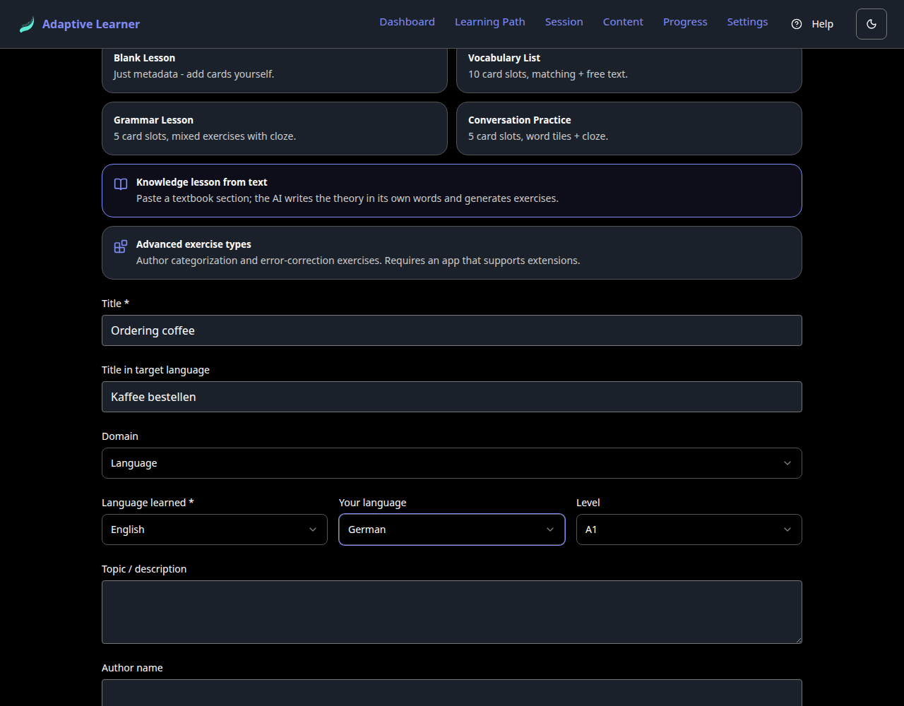
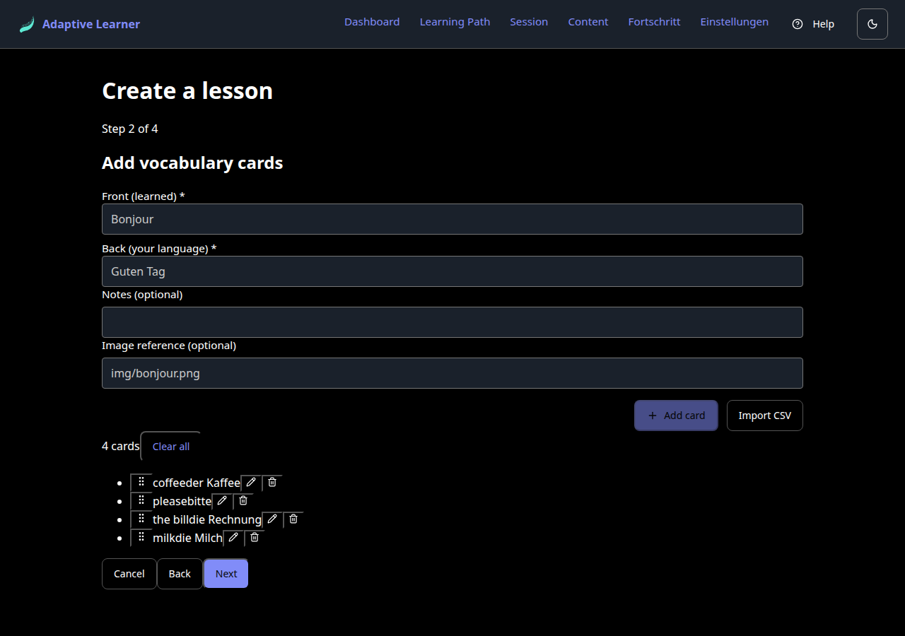
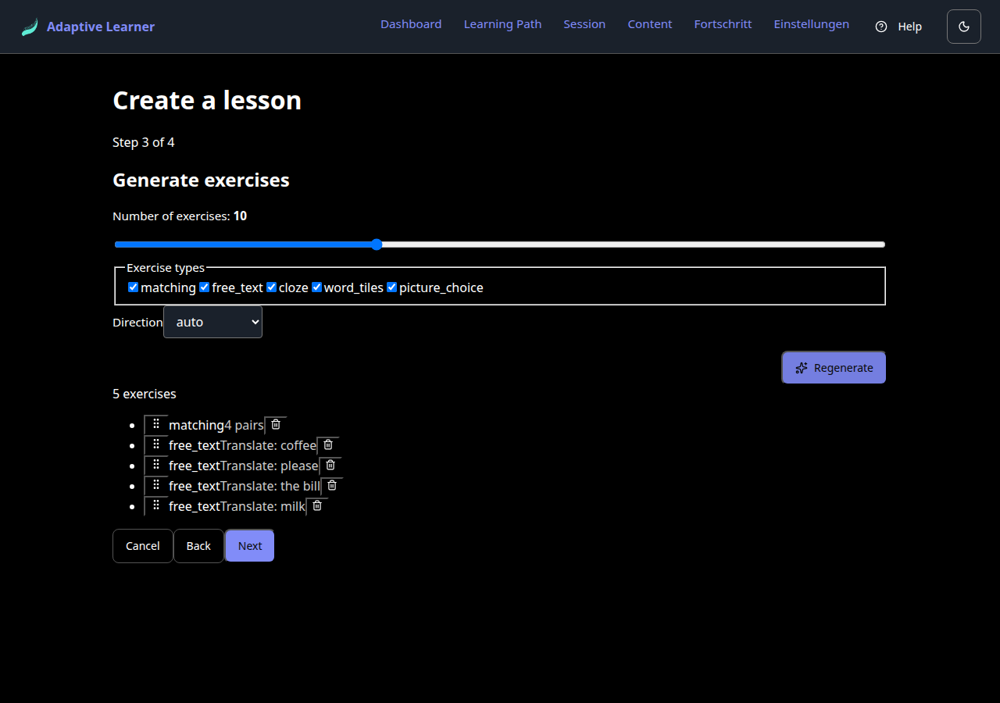
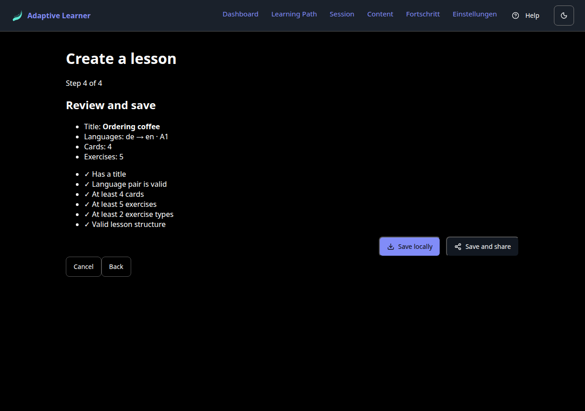
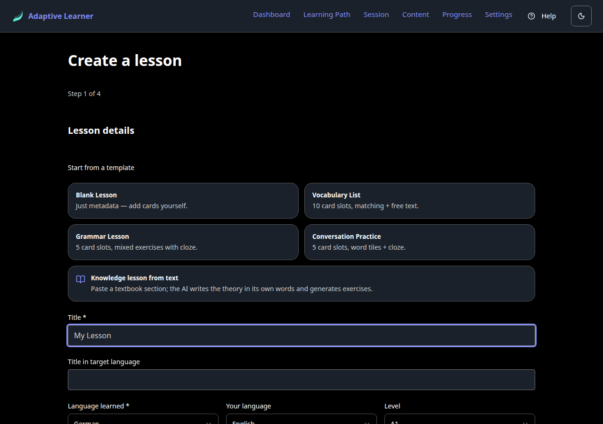
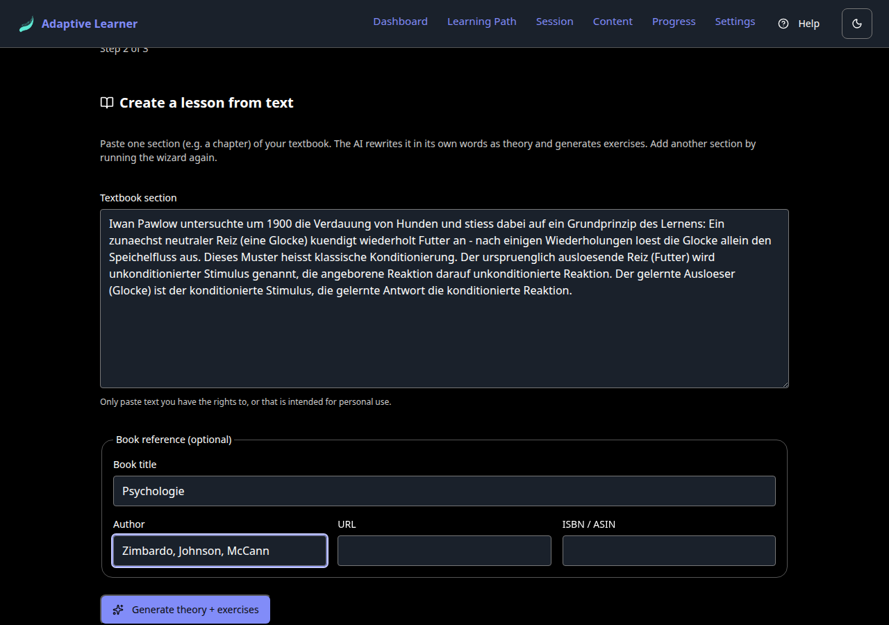
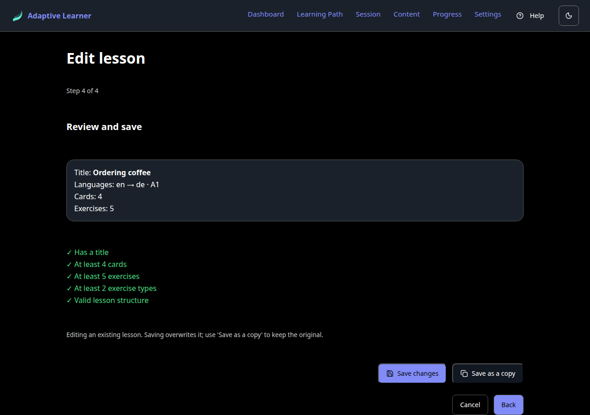

# Create a Lesson in the App, Step by Step

*A hands-on walkthrough of the lesson creator in adaptive-learner: the classic four wizard steps from an empty form to a saved, schema-valid lesson, the newer book-text path that turns a pasted textbook chapter into a knowledge lesson, and the wizard's edit mode. Every screenshot in this guide comes from the running app, captured during the exact flow described.*

`adaptive-learner` · for teachers and content authors · part 3 of the series

The [previous article](one-source-many-outputs.md) made a promise: you don't have to write lesson JSON by hand. This one keeps it. We build a small real lesson ("Ordering coffee", English for German speakers) in the app's lesson creator and end with a lesson that passes the same quality checks every other lesson in the ecosystem passes. No editor, no terminal, no JSON.

## Where the creator lives

The creator is a page in the app: open `/create-lesson` (or follow the create action from the Content area). On the classic path it is a four-step wizard, and the steps mirror exactly what a lesson *is* in the canonical schema: metadata, cards, exercises, and a final review. You can go back at any step; nothing is saved until you say so. Two more doors lead into the same wizard, and we will walk through both after the classic path: a **book-text path** that builds a knowledge lesson from a pasted textbook chapter, and an **edit mode** that reopens any lesson you own.

## Step 1: Lesson details

The first step collects the metadata that every lesson carries: a title, an optional title in the target language, the language pair, a level, and an optional topic and author name.

For our example:

| Field | Value |
|---|---|
| Title | Ordering coffee |
| Title in target language | Kaffee bestellen |
| Language learned | English |
| Your language | German |
| Level | A1 |

Two things are worth noticing. First, the language pair here is the same `target_language` / `source_language` pair the schema records; the wizard just gives it friendlier names ("Language learned" and "Your language"). Second, there are starter templates (blank, vocabulary, grammar, conversation, and the newer "Knowledge lesson from text", which we cover below) if you'd rather not begin from an empty form; the applied template shows a pressed state so you can see which one is active. For this walkthrough we simply fill the fields and press **Next**.

## Step 2: Add vocabulary cards

Cards are the raw material of a lesson: the words and phrases the exercises will drill. Each card has a front (in the language being learned) and a back (in your language), plus optional notes and an image reference.

We add four:

| Front (learned) | Back (your language) |
|---|---|
| coffee | der Kaffee |
| please | bitte |
| the bill | die Rechnung |
| milk | die Milch |

Type front and back, press **Add card**, repeat. The list below the form grows as you go, and each entry can be edited, deleted, or reordered. If you already have vocabulary in a spreadsheet, **Import CSV** takes it in one step instead of four.

## Step 3: Generate exercises

This is the step that would be tedious by hand, and the wizard does it for you. Pick how many exercises you want, which types are allowed (matching, free text, cloze, word tiles, picture choice), and a direction preference (receptive, productive, or balanced). Then press **Auto-generate exercises**.

For our four cards the generator produced five exercises: one matching exercise over all four pairs, and one translation prompt per card. Two details matter here:

- **The generation is deterministic and local.** It derives exercises from your cards by rule, not by a language model, so it needs no API key and produces the same kind of result every time. Don't like the mix? **Regenerate**, adjust the type checkboxes, or delete individual exercises from the list.
- **The exercises are real schema exercises.** What the generator emits are the same `matching` and `free_text` structures a hand-written lesson JSON would contain. The wizard is writing the canonical format for you, one form at a time.

## Step 4: Review and save

The last step shows the lesson summary and, more importantly, a checklist:

- Has a title
- Language pair is valid
- At least 4 cards
- At least 5 exercises
- At least 2 exercise types
- Valid lesson structure

If that list looks familiar, it should: these are the same quality minima the content repositories enforce in CI (the quality floor from the previous article). The wizard runs them *before* you save, so a lesson that leaves this screen green is already the kind of lesson the rest of the pipeline accepts. A red item blocks nothing silently; it tells you exactly what is missing.

Then, two ways out:

- **Save locally** stores the lesson in the app itself. It shows up alongside your other content and can be played immediately, with spaced repetition tracking it like any other lesson.
- **Save and share** goes further: it walks you through contributing the lesson to a content repository on GitHub. With a token configured, the app forks the repository, creates a branch, commits the lesson, and opens the pull request for you; without one, it prepares a pre-filled URL you can complete by hand. Either way the destination is the same reviewable, versioned home the rest of the content lives in.

## The book-text path: a knowledge lesson from a chapter

The four steps above assume vocabulary cards. Since then the wizard has grown a second way in, built for **knowledge lessons**: material written in the same language it teaches, like the psychology and technology sets in the content ecosystem. The entry is the last starter template on step 1:

Choosing it switches the wizard to a shorter three-step flow: metadata, book text, review. The middle step is where the work happens - you paste **one section of a textbook** (a chapter is the right size), optionally add the book reference, and press **Generate theory + exercises**:

What happens on generate is deliberately NOT a copy-paste job:

- **The AI rewrites the text in its own words.** The rephrase prompt carries an explicit guardrail - reformulate, never reproduce the wording verbatim - both for copyright reasons and because a rephrasing that has to survive in its own words is a better theory text than a quote. It is a design guardrail, not a user option, and a unit test pins that the prompt carries it. The UI reminds you of your side of the deal too: paste only text you have the rights to, or that is intended for personal use.
- **The exercises point back at the theory.** Each generated exercise is linked to its theory step via the schema's `theory_ref` field, using the same resolver the app uses at play time, so the write side and the read side cannot diverge.
- **The book reference travels with the set.** Title, author, URL and ISBN/ASIN land in the set's `book` block - the same field the official content sets use for their companion books.

This path calls a language model, so it is the one part of the creator that needs an API key (bring your own; Anthropic, OpenAI or Gemini). Without a key configured, the step tells you so in plain words instead of failing.

One run of the wizard produces one lesson in one set. For a book with many chapters, run the wizard once per chapter; every set carries the same book block, so the lessons stay visibly related.

## The wizard is now also the editor

The second door: every lesson you created (or imported) can be reopened. In the Content area, own lessons carry an **Edit** action - lessons from foreign repositories stay read-only - and it opens the same wizard, pre-filled with the lesson's title, languages, cards and exercises. Walk the steps, change what you want, and the review screen offers a choice the create flow does not have:

- **Save changes** overwrites the lesson in place, keeping the same set id and lesson filename. That detail matters: spaced-repetition progress is keyed on the filename and the card content, so unchanged cards keep their learning history, edited or removed cards fall away cleanly, and new cards start fresh. Editing a typo does not reset your streak.
- **Save as a copy** leaves the original untouched and writes a new lesson next to it.

Alongside editing, the same area lets you **combine several of your own lessons into one set** - select them, group them into a new set (or append to an existing one), and the result is a normal own set that exports and shares like any other. Both features route through the same save path as everything else in this article, so nothing about the output format changes.

## What you just made

The output of these steps is not a proprietary in-app object. It is a lesson in the same canonical schema this whole series is about: cards, steps, exercises, metadata, all validated. That means everything from the previous article applies to it. It renders as an interactive exercise with spaced repetition. It can travel to a content repository through a pull request, where the same validator gates it in CI. One source, and you never opened a text editor.

## Honest limits

The creator is deliberately the *simple* path, and it has edges:

- It covers the core exercise types. Extension types (the graded quiz from the school-test use case, categorization, and friends) are not authorable here yet; those still start life as JSON, or wait for the richer teacher-facing editor that is planned.
- The card-path generator is rule-based on purpose. It produces solid drill exercises from your cards and needs no API key; it does not invent prose. Theory-rich lessons are now the book-text path's job - that one does write theory, and in exchange it is the only part that needs a model key.
- The book-text path takes pasted text only. PDF or Word upload and automatic chapter detection are not built; splitting a book into chapters is still your call.

For the everyday case (a teacher or learner who wants a small, clean vocabulary lesson that plays immediately and can be shared properly) the four steps above are the whole job. For turning a textbook chapter into a playable knowledge lesson, the book-text path is; and when either result needs a second pass, the wizard doubles as the editor.

---

*Four steps, no JSON: metadata, cards, generated exercises, and a review that runs the same quality floor as CI. And two doors more: a textbook chapter in, a knowledge lesson out; and every own lesson editable without losing its progress.*
