# Eine Lektion in der App erstellen, Schritt für Schritt

*Eine praktische Tour durch den Lektions-Editor in adaptive-learner: die klassischen vier Assistenten-Schritte vom leeren Formular bis zur gespeicherten, schema-gültigen Lektion, der Buch-Pfad, der aus eingefügten oder hochgeladenen Lehrbuchkapiteln Wissens-Lektionen macht, der Erweiterungs-Pfad, der die fünf fortgeschrittenen Übungstypen ohne JSON autorierbar macht, und der Bearbeitungsmodus des Assistenten. Jeder Screenshot in dieser Anleitung stammt aus der laufenden App, aufgenommen während des exakt beschriebenen Ablaufs.*

`adaptive-learner` · für Lehrende und Content-Autoren · Teil 3 der Serie

Der [vorige Artikel](one-source-many-outputs.md) machte ein Versprechen: Sie müssen Lektions-JSON nicht von Hand schreiben. Dieser Artikel löst es ein. Wir bauen eine kleine echte Lektion ("Ordering coffee", Englisch für Deutschsprachige) im Lektions-Editor der App und enden mit einer Lektion, die dieselben Qualitätsprüfungen besteht wie jede andere Lektion im Ökosystem. Kein Editor, kein Terminal, kein JSON.

## Wo der Editor lebt

Der Editor ist eine Seite in der App: Öffnen Sie `/create-lesson` (oder folgen Sie der Erstellen-Aktion im Inhalte-Bereich). Auf dem klassischen Pfad ist es ein vierstufiger Assistent, und die Schritte spiegeln genau wider, was eine Lektion im kanonischen Schema *ist*: Metadaten, Karten, Übungen und eine abschließende Überprüfung. Sie können in jedem Schritt zurückgehen; nichts wird gespeichert, bevor Sie es sagen. Drei weitere Türen führen in denselben Assistenten, und wir gehen jede nach dem klassischen Pfad durch: einen **Buch-Text-Pfad**, der aus einem eingefügten Lehrbuchkapitel eine Wissens-Lektion baut, einen **Erweiterungs-Pfad** für die fortgeschrittenen Übungstypen und einen **Bearbeitungsmodus**, der jede eigene Lektion wieder öffnet.

## Schritt 1: Lektionsdetails

Der erste Schritt sammelt die Metadaten, die jede Lektion trägt: einen Titel, einen optionalen Titel in der Zielsprache, eine Content-Domäne, das Sprachpaar, ein Niveau sowie ein optionales Thema und einen Autorennamen. Die Domänen-Auswahl ist hier neu und spiegelt das `domain`-Feld des Schemas: Wählen Sie eine Wissens-Domäne (etwa Psychologie), klappt das Formular das Sprachpaar zu einer einzelnen Inhaltssprache zusammen, weil eine Wissens-Lektion in einer Sprache lehrt statt zwischen zweien.

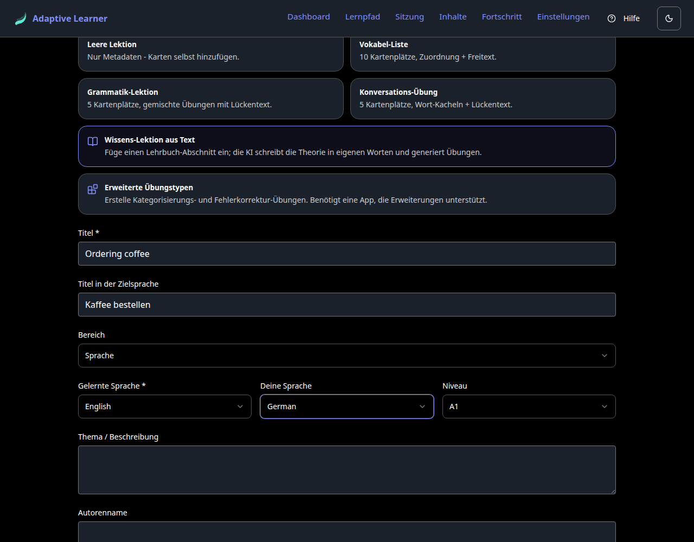

Für unser Beispiel:

| Feld | Wert |
|---|---|
| Titel | Ordering coffee |
| Titel in der Zielsprache | Kaffee bestellen |
| Gelernte Sprache | Englisch |
| Deine Sprache | Deutsch |
| Niveau | A1 |

Zwei Dinge sind hier bemerkenswert. Erstens ist das Sprachpaar dasselbe `target_language` / `source_language`-Paar, das auch das Schema festhält; der Assistent gibt ihm nur freundlichere Namen ("Gelernte Sprache" und "Deine Sprache"). Zweitens beginnen in der Vorlagen-Reihe auch die alternativen Pfade des Assistenten: neben den vier Start-Vorlagen (leer, Vokabeln, Grammatik, Konversation) stehen "Wissens-Lektion aus Text" und "Erweiterte Übungstypen", beide weiter unten behandelt. Die angewandte Vorlage zeigt einen gedrückten Zustand, sodass Sie sehen, welche aktiv ist. Für diese Tour füllen wir einfach die Felder aus und drücken **Weiter**.

## Schritt 2: Vokabelkarten hinzufügen

Karten sind das Rohmaterial einer Lektion: die Wörter und Wendungen, die die Übungen einüben. Jede Karte hat eine Vorderseite (in der gelernten Sprache) und eine Rückseite (in Ihrer Sprache), dazu optionale Notizen, einen Beispielsatz, alternative akzeptierte Antworten und ein Bild.

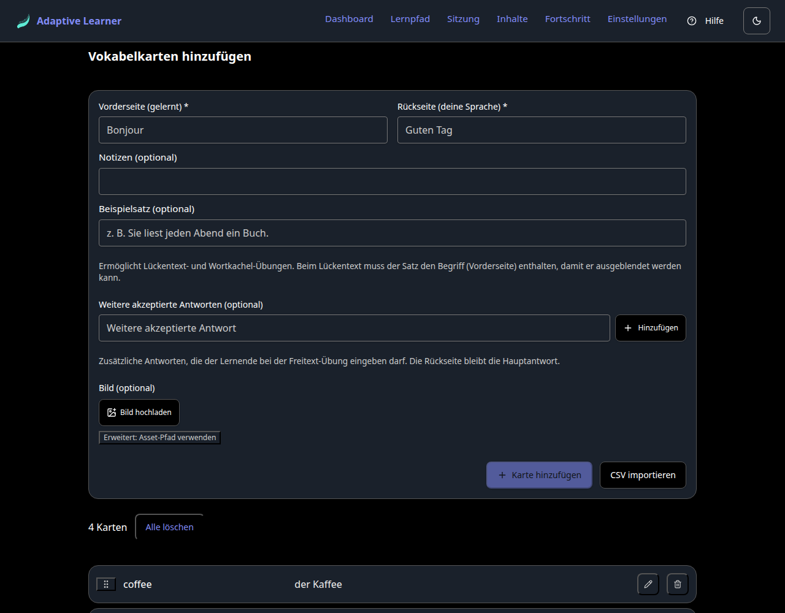

Wir fügen vier hinzu:

| Vorderseite (gelernt) | Rückseite (deine Sprache) |
|---|---|
| coffee | der Kaffee |
| please | bitte |
| the bill | die Rechnung |
| milk | die Milch |

Vorderseite und Rückseite eintippen, **Karte hinzufügen** drücken, wiederholen. Die Liste unter dem Formular wächst mit, und jeder Eintrag lässt sich bearbeiten, löschen oder umsortieren. Wenn Sie Vokabeln bereits in einer Tabelle haben, übernimmt **CSV importieren** sie in einem Schritt statt in vier.

Ein Feld verdient einen genaueren Blick, weil es still entscheidet, was der nächste Schritt für Sie bauen kann: der **Beispielsatz**. Sein Hinweis sagt es direkt: Er ermöglicht Lückentext- und Wort-Kachel-Übungen, und beim Lückentext muss der Satz den Vorderseiten-Begriff enthalten, damit dieser ausgeblendet werden kann. Das macht aus einem früheren Ratespiel etwas, das im Moment des Autorierens sichtbar ist. Dasselbe gilt für das **Bild**, das die Bildauswahl braucht. Lassen Sie beide weg, hat der Generator schlicht weniger Material; Schritt 3 sagt es Ihnen, statt stillschweigend weniger Übungen zu erzeugen.

## Schritt 3: Übungen erstellen

Das ist der Schritt, der von Hand mühsam wäre, und der Assistent erledigt ihn für Sie. Wählen Sie, wie viele Übungen Sie möchten, welche Typen erlaubt sind und eine Richtungspräferenz. Dann drücken Sie **Übungen automatisch erstellen**.

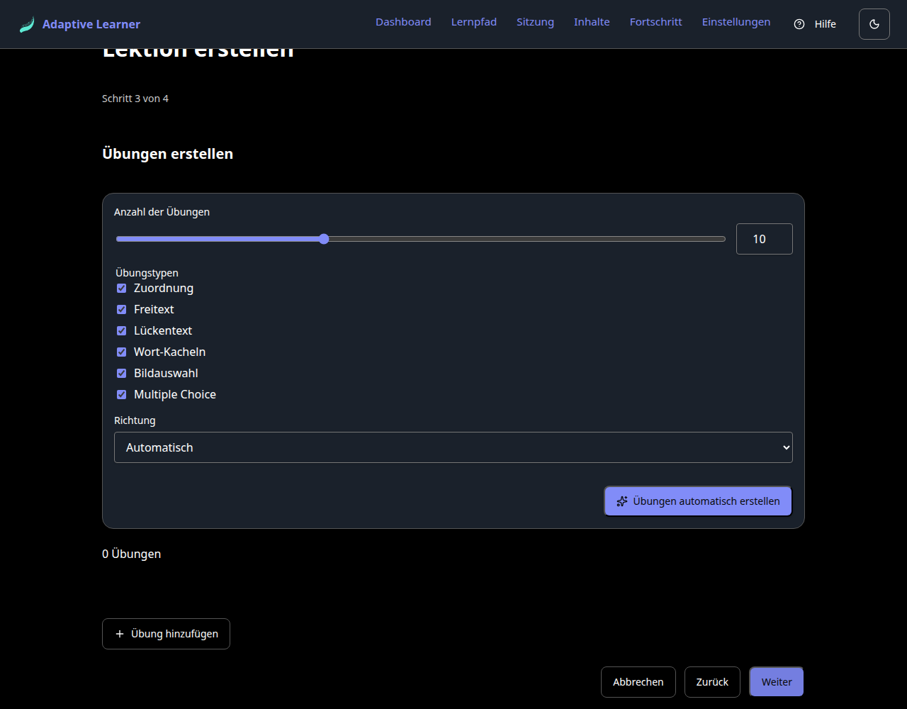

Die Typenliste hält jetzt alle sechs Kern-Übungstypen: Zuordnung, Freitext, Lückentext, Wort-Kacheln, Bildauswahl und Multiple Choice. Multiple Choice ist erwähnenswert, weil es ein *Kern*-Typ ist, keine Erweiterung: Es ging in den eigentlichen Übungstyp-Enum des Schemas ein, sodass jeder Konsument des Formats es versteht, ohne sich für irgendetwas zu entscheiden.

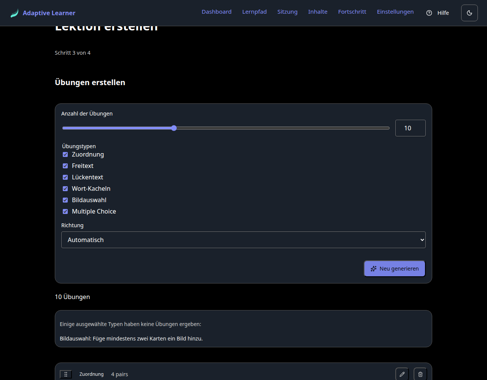

Für unsere vier Karten erzeugte der Generator zehn Übungen, beginnend mit einer Zuordnungsübung über alle vier Paare. Er meldet auch, was er *nicht* tun konnte, und zwar als Handlungsanweisung statt als Beschwerde: "Einige ausgewählte Typen haben keine Übungen ergeben: Bildauswahl: Füge mindestens zwei Karten ein Bild hinzu." Dieser Hinweis ist der Sinn der optionalen Felder aus Schritt 2. Lückentext und Wort-Kacheln brauchen Beispielsätze, Bildauswahl braucht Bilder, und der Schritt benennt sowohl die fehlende Voraussetzung als auch ihre Behebung, statt stillschweigend eine kürzere Liste zurückzugeben.

Vier weitere Details sind hier wichtig:

- **Die Erstellung ist deterministisch und lokal.** Sie leitet Übungen regelbasiert aus Ihren Karten ab, nicht über ein Sprachmodell, braucht also keinen API-Schlüssel und liefert jedes Mal dasselbe Ergebnis. Um die Mischung zu ändern, drücken Sie **Neu generieren**, passen die Typ-Kontrollkästchen an oder löschen einzelne Übungen aus der Liste.
- **Die Übungen sind echte Schema-Übungen.** Was der Generator ausgibt, sind dieselben `matching`- und `free_text`-Strukturen, die auch ein von Hand geschriebenes Lektions-JSON enthielte. Der Assistent schreibt das kanonische Format für Sie, ein Formular nach dem anderen.
- **Jede Übung ist direkt bearbeitbar.** Die erzeugte Ausgabe ist ein Ausgangspunkt, kein Urteil: Öffnen Sie einen Eintrag und passen Sie die Aufgabenstellung, die akzeptierten Antworten, die Optionen an. Sie bearbeiten die Übung, statt drumherum neu zu generieren.
- **Sie müssen gar nicht generieren.** **Übung hinzufügen** erstellt eine von Hand, wobei Sie den Typ selbst wählen. Das schließt die Lücke für die Übung, die der Generator nicht aus Ihren Karten ableiten kann, und macht den Generator zu einer Bequemlichkeit statt zum einzigen Weg hinein.

## Schritt 4: Überprüfen und speichern

Der letzte Schritt zeigt die Lektionsübersicht und, wichtiger, eine Checkliste:

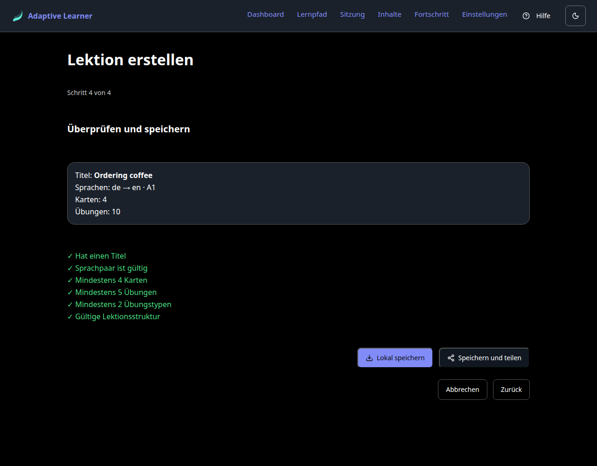

- Hat einen Titel
- Sprachpaar ist gültig
- Mindestens 4 Karten
- Mindestens 5 Übungen
- Mindestens 2 Übungstypen
- Gültige Lektionsstruktur

Falls diese Liste bekannt aussieht, sollte sie das: Es sind dieselben Qualitäts-Mindestwerte, die die Content-Repositories in der CI durchsetzen (der Qualitäts-Boden aus dem vorigen Artikel). Der Assistent führt sie *vor* dem Speichern aus, sodass eine Lektion, die diesen Bildschirm grün verlässt, bereits die Art Lektion ist, die der Rest der Pipeline akzeptiert. Ein roter Punkt blockiert nichts stillschweigend; er sagt Ihnen genau, was fehlt.

Dann zwei Wege hinaus:

- **Lokal speichern** legt die Lektion in der App selbst ab. Sie erscheint neben Ihren anderen Inhalten und kann sofort gespielt werden, wobei die verteilte Wiederholung sie wie jede andere Lektion verfolgt.
- **Speichern und teilen** geht weiter: Es führt Sie durch das Beitragen der Lektion zu einem Content-Repository auf GitHub. Mit konfiguriertem Token forkt die App das Repository, erstellt einen Branch, committet die Lektion und öffnet den Pull Request für Sie; ohne Token bereitet sie eine vorausgefüllte URL vor, die Sie von Hand vervollständigen. So oder so ist das Ziel dasselbe überprüfbare, versionierte Zuhause, in dem der übrige Content lebt.

## Der Buch-Text-Pfad: eine Wissens-Lektion aus einem Kapitel

Die vier Schritte oben setzen Vokabelkarten voraus. Der Assistent hat einen zweiten Weg hinein, gebaut für **Wissens-Lektionen**: Material, das in derselben Sprache geschrieben ist, die es lehrt, wie die Psychologie- und Technologie-Sets im Content-Ökosystem. Der Einstieg sitzt in der Vorlagen-Reihe in Schritt 1 (zuerst einen Titel eintragen; die Vorlagen-Pfade verlangen einen, bevor sie sich öffnen):

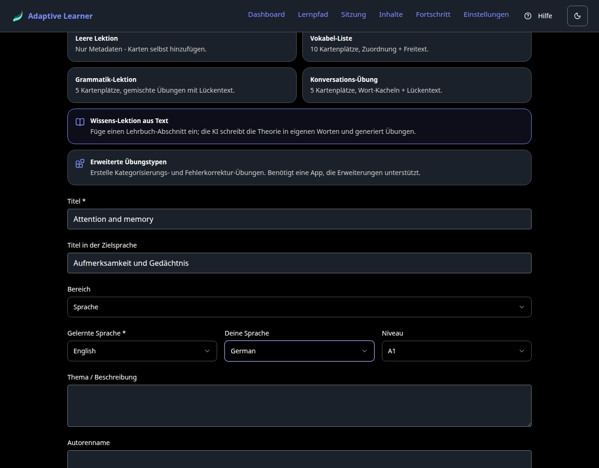

Sie zu wählen schaltet den Assistenten auf einen kürzeren dreistufigen Ablauf um: Metadaten, Buchtext, Überprüfung. Der mittlere Schritt ist, wo die Arbeit passiert, und er nimmt den Text inzwischen auf zwei Wegen an. Der erste ist der ursprüngliche: Sie fügen **einen Abschnitt eines Lehrbuchs** ein (ein Kapitel ist die richtige Größe), fügen optional die Buchangabe hinzu und drücken **Theorie + Übungen generieren**:

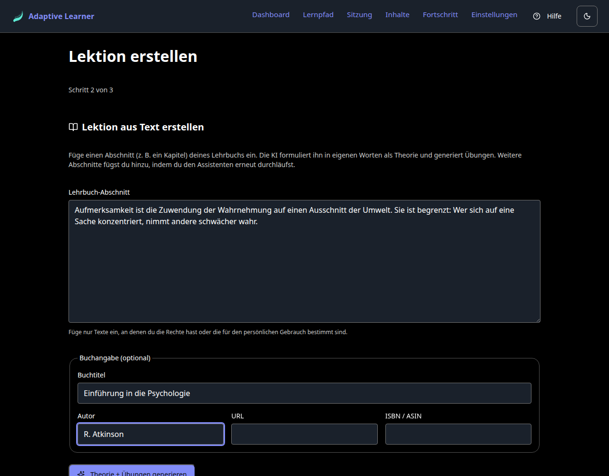

Der zweite Weg spart die Kopierrunden ganz: **Aus Datei laden** liest eine komplette Buchdatei (EPUB, DOCX, reiner Text oder Markdown), erkennt ihre Abschnitte aus der Dokumentstruktur und zeigt sie als Auswahlliste. Abschnitte, die nach Vor- oder Nachspann aussehen (ein Vorwort, ein Glossar, ein Index), kommen abgewählt an; alles andere ist ausgewählt. Wählen Sie die gewünschten Kapitel, und ein Klick generiert **eine Lektion pro gewähltem Abschnitt** in einem einzigen Batch-Lauf:

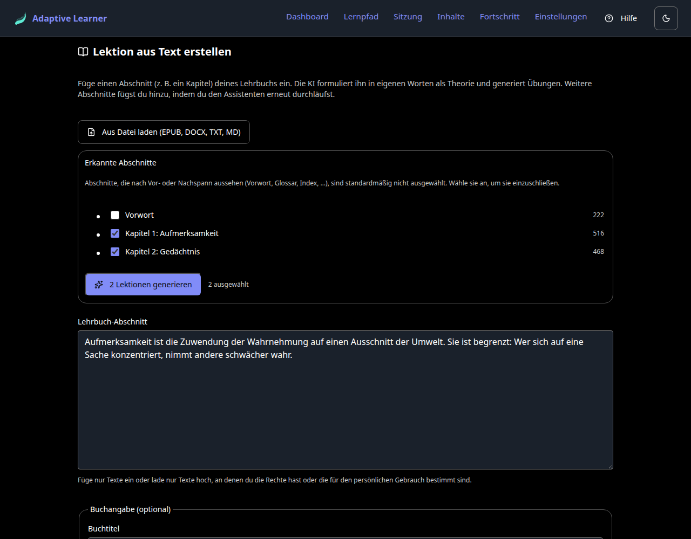

Was beim Generieren passiert, ist bewusst KEINE Kopieraktion:

- **Die KI schreibt den Text in eigenen Worten um.** Die Umformulierungs-Anweisung trägt eine ausdrückliche Leitplanke (umformulieren, den Wortlaut nie wörtlich wiedergeben), sowohl aus Urheberrechtsgründen als auch, weil eine Umformulierung, die in eigenen Worten bestehen muss, ein besserer Theorietext ist als ein Zitat. Es ist eine Design-Leitplanke, keine Nutzeroption, und ein Unit-Test hält fest, dass die Anweisung sie trägt. Die Oberfläche erinnert Sie auch an Ihren Teil der Abmachung: Fügen Sie nur Text ein, an dem Sie die Rechte haben oder der für den persönlichen Gebrauch bestimmt ist.
- **Die Übungen verweisen zurück auf die Theorie.** Jede erzeugte Übung ist über das Schema-Feld `theory_ref` mit ihrem Theorie-Schritt verknüpft, mit demselben Resolver, den die App zur Spielzeit nutzt, sodass Schreibseite und Leseseite nicht auseinanderlaufen können.
- **Die Buchangabe reist mit dem Set.** Titel, Autor, URL und ISBN/ASIN landen im `book`-Block des Sets, demselben Feld, das die offiziellen Content-Sets für ihre Begleitbücher nutzen.

Dieser Pfad ruft ein Sprachmodell auf, ist also der eine Teil des Editors, der einen API-Schlüssel braucht (bringen Sie Ihren eigenen mit; Anthropic, OpenAI oder Gemini). Ohne konfigurierten Schlüssel sagt der Schritt es Ihnen in klaren Worten, statt zu scheitern.

Auf dem Einfüge-Pfad erzeugt ein Durchlauf des Assistenten eine Lektion in einem Set; arbeiten Sie Abschnitt für Abschnitt, durchlaufen Sie ihn einmal pro Kapitel. Auf dem Upload-Pfad deckt ein Durchlauf so viele Kapitel ab, wie Sie ausgewählt haben, je eine Lektion. In beiden Fällen trägt jede Lektion denselben Buch-Block, sodass sie sichtbar verwandt bleiben.

## Der Erweiterungs-Pfad: fortgeschrittene Übungstypen

Die sechs Kern-Typen decken das alltägliche Einüben ab. Manche Übungsformen passen in keinen davon, und die leben in der Erweiterungs-Schicht: einer getrennten, freiwilligen Ebene, die Übungstypen hinzufügt, ohne das Kern-Schema zu verbreitern (der zweite Artikel erklärt, warum diese Grenze existiert). Bis vor Kurzem waren sie nur als JSON verfügbar. Das sind sie nicht mehr. Der Eintrag **Erweiterte Übungstypen** in der Vorlagen-Reihe öffnet ihren eigenen Assistenten-Zweig:

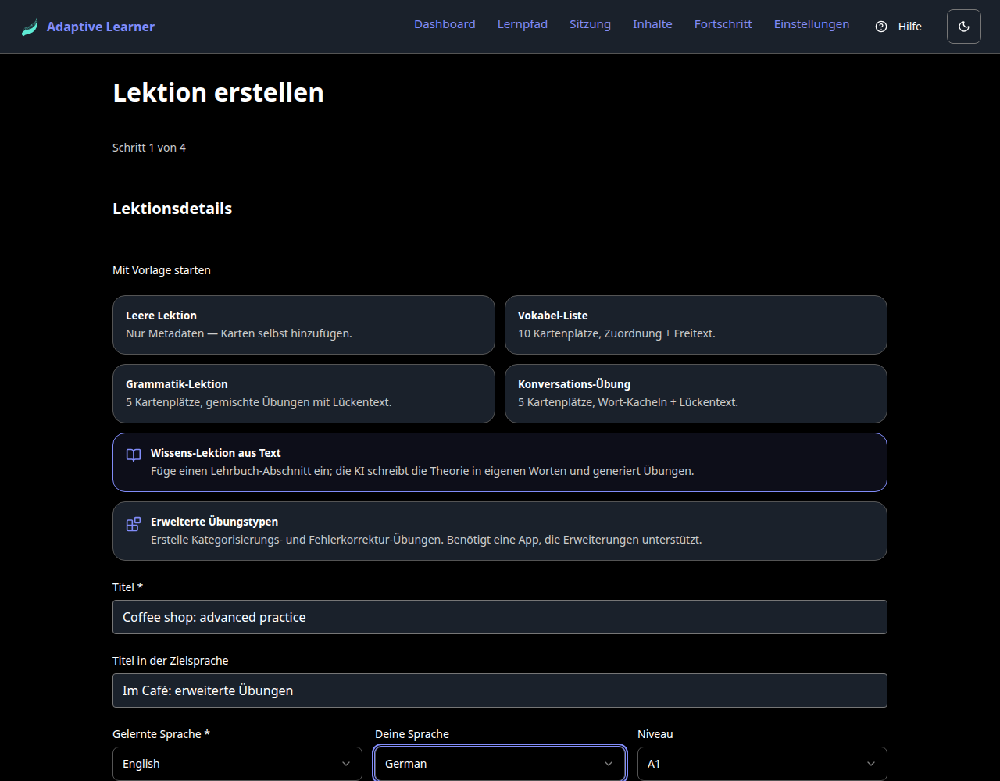

Ihn zu wählen schaltet auf einen kürzeren dreistufigen Ablauf um: Metadaten, Übungen, Überprüfung. Kein Karten-Schritt, weil Erweiterungsübungen ihren eigenen Inhalt tragen, statt auf Karten zurückzugreifen. **Erweiterungsübung hinzufügen** öffnet die Typ-Auswahl, und alle fünf adoptierten Typen sind da:

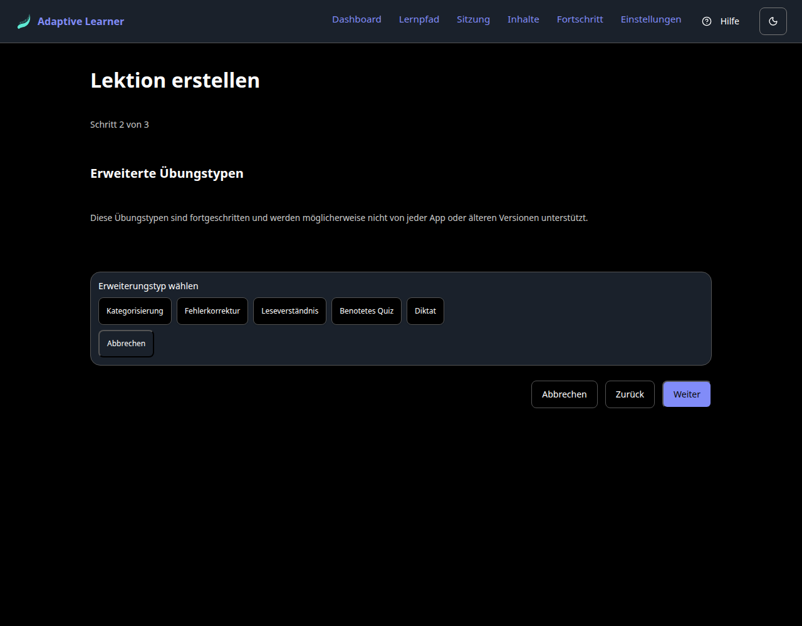

Die Auswahl zeigt die Typen unter ihren deutschen Namen. Darunter liegt jeweils ein namensraum-gebundener `ext:`-Typ, den die Lektion in `requires_extensions` deklariert, sodass ein Konsument ohne diese Erweiterung die Lektion laut ablehnt, statt sie falsch darzustellen. Wofür jeder da ist, mit seiner technischen Id und einem kleinen Beispiel aus einem Französisch-Kurs für Deutschsprachige:

| Typ in der App | Technische Id | Was die lernende Person tut | Beispiel |
|---|---|---|---|
| Kategorisierung | `ext:al-categorization` | Sortiert Elemente in benannte Behälter | *pomme, carotte, banane, poireau* nach **Obst** und **Gemüse** einordnen |
| Fehlerkorrektur | `ext:al-error-correction` | Findet und behebt einen eingebauten Fehler | *"Elle a mangé des pomme."* Der Fehler: *pomme* muss *pommes* heißen |
| Leseverständnis | `ext:al-reading-comprehension` | Liest einen Text, beantwortet mehrere Fragen dazu | *"Marie habite à Paris. Elle travaille dans un café le matin et étudie le français le soir."* Frage: Wo arbeitet Marie? |
| Benotetes Quiz | `ext:al-graded-quiz` | Bearbeitet ein bewertetes Fragenset mit Bestehensgrenze | Drei Fragen zu Begrüßungen, je ein Punkt, bestanden bei 2 von 3 |
| Diktat | `ext:al-dictation` | Hört einen Clip und tippt, was gesagt wurde | *"Comment ça va?"* hören, mit oder ohne Akzent akzeptiert |

Diktat ist der jüngste der fünf, und sein Editor zeigt, wie ein in sich geschlossenes Erweiterungs-Payload aussieht:

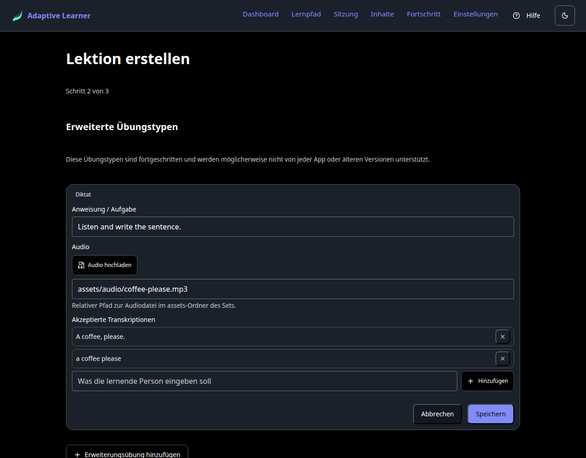

Drei Felder, nicht mehr: die Anweisung, die die lernende Person sieht, das **Audio** und die Liste der **akzeptierten Transkriptionen**. Die Akzeptanzliste ist der Grund, warum Diktat auf die richtige Weise nachsichtig ist: Sie legen im Voraus fest, dass *"a coffee please"* genauso zählt wie *"A coffee, please."*, sodass der Bewerter nicht raten muss, wie streng er mit Groß-/Kleinschreibung und Zeichensetzung sein soll.

Das Audio-Feld nimmt den Clip auf zwei Wegen. **Audio hochladen** legt ihn selbstständig bei der Lektion ab, eingebettet als Data-URI, was der schnelle Weg für eine lokal gehaltene Lektion ist. Oder Sie tippen einen relativen Pfad zu einer Datei im `assets`-Ordner des Sets, was ein veröffentlichtes Repo-Set möchte, weil ein eingebetteter Clip im Lektions-JSON mitreist und es aufbläht.

Das Speichern funktioniert genau wie überall sonst im Editor. Die Lektion, die herauskommt, ist eine normale Lektion im kanonischen Schema, mit einer Ergänzung: Sie deklariert die Erweiterung, die sie nutzt, sodass der Portabilitäts-Vertrag hält.

## Der Assistent ist jetzt auch der Editor

Die zweite Tür: Jede Lektion, die Sie erstellt (oder importiert) haben, lässt sich wieder öffnen. Im Inhalte-Bereich tragen eigene Lektionen eine **Bearbeiten**-Aktion (Lektionen aus fremden Repositories bleiben schreibgeschützt), und sie öffnet denselben Assistenten, vorausgefüllt mit Titel, Sprachen, Karten und Übungen der Lektion. Ein Set mit mehr als einer Lektion zeigt zuerst eine Auswahl, welche Lektion bearbeitet werden soll, und eine Buch-Text-Lektion öffnet sich im Übungs-Editor (Theorie und Buch-Block reisen mit) statt im leeren Karten-Schritt. Gehen Sie die Schritte durch, ändern Sie, was Sie möchten, und der Überprüfungs-Bildschirm bietet eine Wahl, die der Erstellen-Ablauf nicht hat:

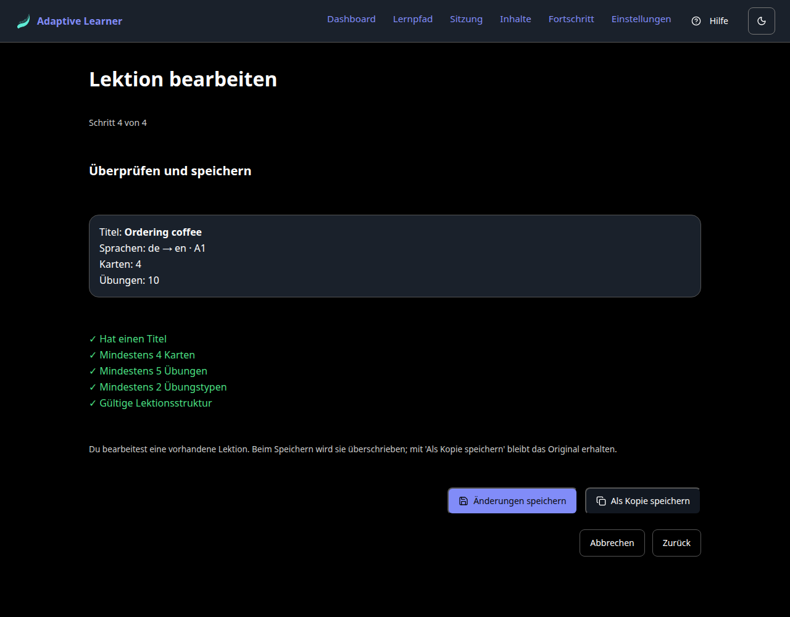

- **Änderungen speichern** überschreibt die Lektion an Ort und Stelle und behält dieselbe Set-Id und denselben Lektions-Dateinamen. Dieses Detail zählt: Der Fortschritt der verteilten Wiederholung ist an den Dateinamen und den Karteninhalt gebunden, sodass unveränderte Karten ihre Lernhistorie behalten, bearbeitete oder entfernte Karten sauber wegfallen und neue Karten frisch beginnen. Einen Tippfehler zu korrigieren setzt Ihre Serie nicht zurück.
- **Als Kopie speichern** lässt das Original unberührt und schreibt eine neue Lektion daneben.

Neben dem Bearbeiten können Sie im selben Bereich **mehrere Ihrer eigenen Lektionen zu einem Set zusammenfassen**: auswählen, zu einem neuen Set gruppieren (oder an ein bestehendes anhängen), und das Ergebnis ist ein normales eigenes Set, das wie jedes andere exportiert und geteilt wird. Beide Funktionen laufen über denselben Speicher-Pfad wie alles andere in diesem Artikel, sodass sich am Ausgabeformat nichts ändert.

## Was Sie gerade gebaut haben

Die Ausgabe dieser Schritte ist kein proprietäres App-internes Objekt. Es ist eine Lektion im selben kanonischen Schema, um das es in dieser ganzen Serie geht: Karten, Schritte, Übungen, Metadaten, alle validiert. Das heißt, alles aus dem vorigen Artikel gilt für sie. Sie wird als interaktive Übung mit verteilter Wiederholung dargestellt. Sie kann per Pull Request zu einem Content-Repository reisen, wo derselbe Validator sie in der CI absichert. Eine Quelle, und Sie haben nie einen Texteditor geöffnet.

## Ehrliche Grenzen

Der Editor ist bewusst der *einfache* Pfad, und er hat Kanten:

- Erweiterungsübungen sind jetzt autorierbar, aber einzeln und von Hand. Es gibt keinen Generator für sie: Der Assistent gibt Ihnen ein Formular pro Typ, keine Regel, die ein benotetes Quiz aus Ihren Karten ableitet. Das ist eine bewusste Reihenfolge der Arbeit (erst autorierbar machen, später automatisieren), kein Versäumnis.
- Diktat nimmt eine vorhandene Audiodatei, entweder hochgeladen (mit der Lektion eingebettet) oder über einen Asset-Pfad referenziert. Einen Clip im Browser aufzunehmen ist nicht gebaut.
- Der Karten-Pfad-Generator ist bewusst regelbasiert. Er erzeugt solide Einübungs-Übungen aus Ihren Karten und braucht keinen API-Schlüssel; er erfindet keine Prosa. Theorie-reiche Lektionen sind jetzt die Aufgabe des Buch-Text-Pfads: Dieser schreibt tatsächlich Theorie und ist im Gegenzug der einzige Teil, der einen Modell-Schlüssel braucht.
- Der Buchdatei-Upload liest EPUB, DOCX, reinen Text und Markdown; PDF ist nicht gebaut. Die Abschnittserkennung folgt der Struktur des Dokuments, eine Datei ohne brauchbare Überschriften kommt also als ein großer Abschnitt an, und auf dem Einfüge-Pfad bleibt das Teilen in Kapitel Ihre Aufgabe.

Für den Alltagsfall (eine Lehrkraft oder lernende Person, die eine kleine, saubere Vokabel-Lektion will, die sofort spielbar und ordentlich teilbar ist) sind die vier Schritte oben die ganze Arbeit. Um ein Lehrbuchkapitel in eine spielbare Wissens-Lektion zu verwandeln, ist es der Buch-Text-Pfad; und wenn eines der Ergebnisse einen zweiten Durchgang braucht, dient der Assistent zugleich als Editor.

---

*Vier Schritte, kein JSON: Metadaten, Karten, generierte Übungen und eine Überprüfung, die denselben Qualitäts-Boden wie die CI ausführt. Und drei Türen mehr: ein Lehrbuchkapitel eingefügt oder eine ganze Buchdatei mit einer Lektion pro gewähltem Kapitel hinein, eine Wissens-Lektion hinaus; die fünf fortgeschrittenen Übungstypen autorierbar in ihrem eigenen Zweig, Diktat inklusive; und jede eigene Lektion bearbeitbar, ohne ihren Fortschritt zu verlieren.*
