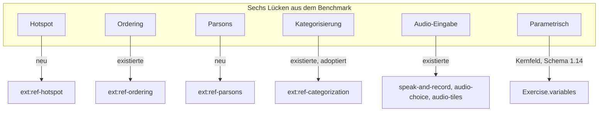
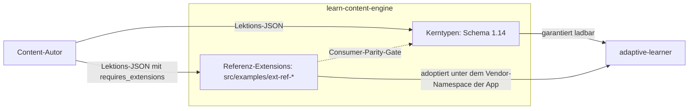
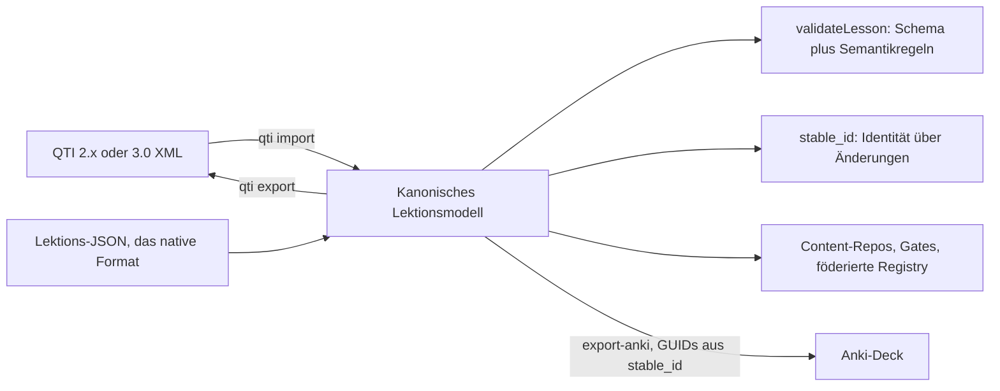

# Haben wir das Rad neu erfunden?

*Eine fremde KI hat unsere Content-Engine gegen QTI, H5P, Moodle, Canvas und Duolingo gebenchmarkt und Lücken gefunden, die längst geschlossen waren. Die Korrektur war kein Code. Dann kam die ehrliche Frage, die ehrliche Antwort, und ein Fehler, den nur die Content-Repositories fangen konnten.*

`learn-content-engine` · Schema aktuell v1.17 · framework-agnostisches TypeScript

## Ein Benchmark von außen

Im September hat eine zweite KI, die unsere Repositories nie von innen gesehen hatte, eine vergleichende Analyse von `learn-content-engine` geschrieben. Sie las, was das Web anbietet: das veröffentlichte JSON-Schema, die TypeDoc-API-Referenz, die README. Dann verglich sie unsere Aufgabentypen mit Moodle, H5P, QTI 3.0, Canvas New Quizzes und Duolingo und listete sechs Lücken: Hotspot, Sequenzierung, Parsons-Probleme, Kategorisierung, Audio-Eingabe, parametrische Aufgaben.

Drei der sechs gab es nicht. `ext:ref-ordering`, `ext:ref-categorization` und drei Audio-Extensions lagen seit Wochen in `src/examples/`, und Kategorisierung war von der App längst adoptiert und in mehreren Content-Repositories im Einsatz. Die Analyse nannte die Engine außerdem „v1.13", das ist die Version des Lektions-Schemas; das Paket stand bei 0.23.0. Zwei Zähler, leicht zu verwechseln, und nichts auf der Site sagte, welcher welcher ist.

Nichts davon war die Schuld des Benchmarks. Die Pages-Site veröffentlichte Schema und API-Referenz. Die README verlinkte ein Dokument namens „Extensions" und nannte keine einzige Extension beim Namen. Von außen hatte die Engine sechs Kern-Aufgabentypen und einen Erweiterungsmechanismus, in dem nichts drin war. Die KI hat unsere Dokumentation gebenchmarkt, nicht unsere Engine, und ihr Bericht war eine zutreffende Lesart dessen, was wir sichtbar gemacht hatten.

## Was wirklich fehlte

Zwei Lücken waren echt. Hotspot (den richtigen Bereich eines Bildes anklicken) und Parsons-Probleme (durcheinandergewürfelte Codezeilen nach Reihenfolge und Einrückung ordnen) hatten nirgends eine Darstellung. Beide folgten dem Muster jeder Referenz-Extension in dieser Engine: ein in sich geschlossenes `ext_payload`, eine Engine-Hälfte, die die Form validiert, eine minimale Konsumenten-Hälfte, die rendert und bewertet, eine Beispiel-Lektion unter Doku-Gate, testgetrieben geschrieben.

Hotspot wurde `ext:ref-hotspot`: eine Bildreferenz plus Zonen, `rect` oder `circle`, in Prozentkoordinaten, damit die Payload nicht wissen muss, wie groß der Konsument das Bild rendert, genau eine Zone korrekt, bewertet per Punkt-in-Zone-Test mit inklusiven Kanten. Parsons wurde `ext:ref-parsons`: die Zeilen des Programms in korrekter Reihenfolge, jede mit Einrückungsstufe, bewertet auf Reihenfolge und Einrückung zusammen, denn die richtige Sequenz in der falschen Tiefe ist immer noch ein falsches Programm. Es hat bewusst keine Eindeutigkeitsregel, anders als Ordering: echter Code wiederholt Anweisungen, und eine Parsons-Oberfläche identifiziert Kacheln über die Position, nicht über den Text.

Die sechste Lücke konnte keine Extension werden. Parametrische Aufgaben (Moodle nennt sie Calculated, Canvas Formula) deklarieren Variablen mit Wertebereichen, und der Konsument zieht sie pro Versuch: „Was ist {{a}} plus {{b}}?" mit `a` und `b` aus 1 bis 20 und einer berechneten akzeptierten Antwort. Die Variablen müssen aus den Kernfeldern referenziert werden, `prompt`, `accept`, Optionstexte, `explanation`, der Substitutionsvertrag durchquert also das Kern-Schema. Eine Extension hätte genau die Typen nachbauen müssen, die sie parametrisieren will. Also wurde `variables` ein Kernfeld in Schema 1.14, additiv wie jede Schema-Änderung hier: gezogene Variablen mit `min`, `max` und optionalem `step`, berechnete Variablen mit einer kleinen Ausdruckssprache (Zahlen, Namen, die vier Grundrechenarten, Klammern, unäres Minus), Referenzen als `{{name}}`. Die Engine prüft Namen, Bereiche, Ausdrücke und Referenzen und wertet niemals etwas aus. Ziehen, Einsetzen und Bewerten gehören dem Konsumenten.

## Die Straße und das Rad

Sobald jede Zeile der Matrix abgedeckt war, wartete die unbequeme Frage: Wenn jeder dieser Typen in Moodle, H5P, QTI, Canvas oder Duolingo existiert, haben wir dann das Rad neu erfunden?

Teilweise, und der Teil, den wir neu erfunden haben, ist der Teil, der nicht zählt. Das Vokabular der Aufgabentypen ist die Straße. Jede Plattform hat Multiple Choice, Lückentext und Zuordnung; ein Format ohne sie wäre seltsam, ein Format mit ihnen ist nicht bemerkenswert. Was ein Format besitzt, ist das, was es rund um die Typen garantiert, und dort wird der Vergleich interessant.

| Was das Format liefert | learn-content-engine | QTI 3.0 | H5P |
|---|---|---|---|
| Striktes Schema plus Semantikregeln mit stabilen Ids | ja (`E-CLOZE-MARKERS`, `E-VAR-UNDEFINED`) | nur XSD | keine |
| Identität über Inhaltsänderungen hinweg | `stable_id`, `retired_ids` | pro Paket | keine |
| Content als Git-Repositories mit CI-Gates | ja, zehn Repositories | XML, machbar | gezippte Pakete |
| Erweiterungsvertrag | deklariert, gepinnt, laut abgelehnt | PCI mit JS-Runtime | Inhaltstypen mit JS-Runtime |
| Fertige Renderer | keine | TAO, Item-Player | rund fünfzig |

Ein Item, dessen Lückenzahl nicht zu seinen Markern passt, ist gültiges QTI und gültiges H5P. Hier ist es `E-CLOZE-MARKERS`, und die CI eines Content-Repositories wird rot, bevor ein Lernender die Lektion je sieht. Eine korrigierte Antwort in einer bestehenden Übung verschiebt für den Lernenden nichts, weil `stable_id` das Element benennt und die Spaced-Repetition-Planung der App darauf joint. Zehn Repositories tragen den Content, jedes mit denselben Gates, einem byte-gepinnten Spiegel des Schemas und einem Eintrag in einer föderierten Registry, die die App übergreifend durchsucht.

QTI 3.0 als natives Format hätte Interoperabilität mit jedem LMS-Autorenwerkzeug gekauft und alle vier Zeilen gekostet: XML, das schlecht difft, keine Semantikschicht, ein Test-und-Item-Modell ohne Theorieschritte oder Karten, und einen Portable-Custom-Interaction-Mechanismus, der dieselbe Idee ist wie unsere `ext:`-Stufe, aber mit einem JavaScript-Runtime-Vertrag, den die Engine bewusst nicht trägt. H5P ist ein Runtime, kein Format: es hätte der App fünfzig fertige Renderer gegeben, und mit ihnen H5Ps Paketierung, das Fehlen von Identität über Versionen hinweg und eine Abhängigkeit vom Player für jede Übung.

Die Antwort lautet also: Die Typen sind die Straße, und ja, wir haben sie noch einmal gepflastert, weil es keinen anderen Weg gibt, eine Straße zu haben. Das Rad sind Validierung, Identität, Föderation und der Erweiterungsvertrag, und keine der fünf Plattformen bietet das als Bibliothek.

## Der Fehler, den der Content gefangen hat

Version 0.24.0 lieferte `variables` mit einem Satz in den Release-Notes aus, der nicht geprüft worden war: Kein bekannter Content nutzt doppelte geschweifte Klammern. Sie reservierte `{{` in jedem String-Feld jeder Übung.

Die Content-Repositories sind auf eine exakte Engine-Version gepinnt und pinnen bewusst neu, jeder Re-Pin lässt das volle Gate über das ganze Repository laufen. Neun von zehn Re-Pins waren grün. Der zehnte, `alc-technology`, meldete zwei Lektionen mit Fehlern. Sein Ansible-Kurs lehrt Jinja2-Templates. `{{ server }}` in einer Aufgabe, einer akzeptierten Antwort, einem Lückensatz und einem Zuordnungspaar war die Lektion, keine Variablenreferenz, und die neue Regel lehnte genau den Content ab, der seit Monaten korrekt war.

Die Korrektur war klein und ging noch am selben Tag als 0.24.1 raus: Nur eine Übung, die `variables` deklariert, wird nach Referenzen durchsucht; ohne den Block sind Klammern gewöhnlicher Text. Die Lehre war größer als die Korrektur. Eine Behauptung über Content muss gegen den Content geprüft werden, und das Gate, das den Fehler fing, ist dasselbe Gate, das der Benchmark nicht sehen konnte. Die Strenge, die das Format wertvoll macht, hat den Fehler auch innerhalb einer Stunde sichtbar gemacht statt in der Sitzung eines Lernenden.

## Austausch am Rand

Der Vergleich hat auch geklärt, wohin Interoperabilität gehört: an den Rand, nicht in den Kern. Der QTI-Adapter der Engine sprach QTI 2.x; die aktuelle Version von 1EdTech ist 3.0, die die Semantik der abbildbaren Teilmenge behielt und die Syntax umbenannte (`qti-choice-interaction` statt `choiceInteraction`, `response-identifier` statt `responseIdentifier`). Drei reine Funktionen tragen jetzt den ganzen Unterschied, der Adapter liest beide Dialekte und schreibt beide, und `learn-content-engine qti import` macht aus einem QTI-Item mit einem Befehl eine validierte Lektion. QTI ist die Eingangstür für alle, deren Content schon in der Assessment-Welt lebt.

Die Ausgangstür zeigt in die andere Richtung. Anki ist das größte Spaced-Repetition-Ökosystem, das es gibt, deshalb hat jedes Content-Repository `make export-anki` bekommen: Karten und die abbildbaren Aufgabentypen werden zu Notizen, und die GUID jeder Notiz leitet sich aus ihrer `stable_id` ab. Wer einen neueren Export in Anki erneut importiert, aktualisiert die Notizen und behält den Lernstand. Das Identitätsversprechen, das das Format innerhalb dieses Ökosystems gibt, reist mit dem Content. Allein das Psychologie-Repository exportiert 2852 Notizen.

## Was ist besser

Die faire Antwort hat keinen einzelnen Gewinner, weil die Kandidaten verschiedene Dinge optimieren.

| Anwendungsfall | Besser |
|---|---|
| Sie betreiben ein LMS oder brauchen LMS-Austausch | QTI 3.0 über TAO oder einen Item-Player, oder Moodle XML |
| Sie wollen fertige interaktive Inhalte mit Editor, in eine Site eingebettet | H5P, mit der GPL-3.0-Lizenz des Kerns als dem Punkt zum Prüfen |
| Sie schreiben Kurse als Text und wollen einen kostenlosen Player | LiaScript, dem Geist nach am nächsten, ohne typisierte Validierung oder Identität |
| Sie brauchen Spaced Repetition im großen Maßstab mit Community | Anki plus genanki |
| Sie bauen eine eigene Lernanwendung und brauchen ein striktes, validiertes, versioniertes Format mit Identität über Änderungen und Content in Git | learn-content-engine |

Die Engine gewinnt genau einen Anwendungsfall, den dieses Ökosystem hat, und bezahlt die Passung mit Größe: ein Konsument, ein Maintainer, ein GitHub-Stern, kein Renderer, keine Autorenoberfläche im Paket. Das sind Fakten, und sie gehören in dasselbe Dokument wie die Stärken, wo sie jetzt auch stehen.

## Was sich an unserer Dokumentation geändert hat

Der eigentliche Befund des Benchmarks betraf Sichtbarkeit, und dort hat sich am meisten geändert. Die README listet jede Referenz-Extension in einer Tabelle mit Einzeiler und Link. Die Markdown-Dokumentation wird auf der Pages-Site neben Schema und API-Referenz gerendert, mit den Diagrammen. Ein Gate prüft jede „aktuell"-Behauptung in der Doku gegen die echte Schema- und Paketversion, sodass das nächste Release keine veraltete Zahl zurücklassen kann. Die vergleichende Analyse selbst lebt im Repository als versioniertes Dokument, korrigiert, wo sie falsch lag, erweitert um das Urteil auf Bibliotheksebene, und ehrlich beim Sternchen-Zähler.

Auf der Anwendungsseite landeten die drei Adoptionen noch am selben Tag: der Pin auf Schema 1.14, die Zieh- und Einsetz-Hälfte von `variables`, und `ext:al-hotspot`, `ext:al-parsons` und `ext:al-ordering` neben den neun Extensions, die die App schon rendert. Ein Lernender kann jede Zeile der Matrix spielen.

Die Lehre handelt nicht von Aufgabentypen. Dokumentation ist die Oberfläche, die ein Produkt allen zeigt, die nicht schon drinnen sind, und ein Benchmark von außen prüft diese Oberfläche und nichts sonst. Wenn die Oberfläche sechs Typen und einen Mechanismus sagt, dann ist das, was man hat, egal wie viel in `src/examples/` liegt.

*Die Typen sind die Straße. Das Rad ist das, was sie zusammenhält, und es zählt erst, wenn jemand von außen es sehen kann.*
