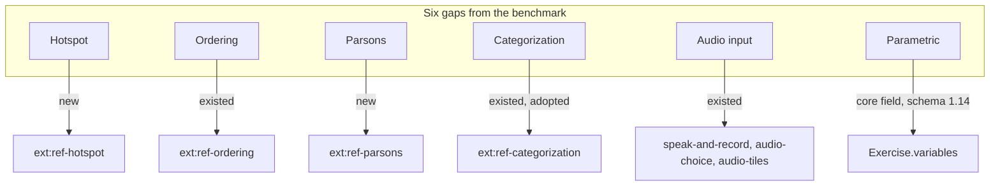
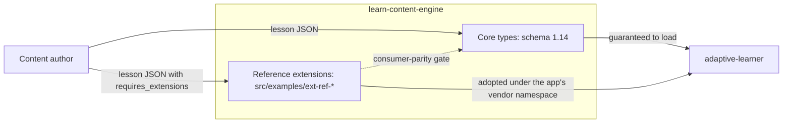
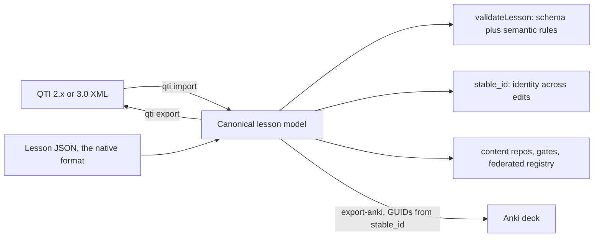

# Did We Reinvent the Wheel?

*An outside AI benchmarked our content engine against QTI, H5P, Moodle, Canvas and Duolingo and found gaps we had already closed. The fix was not code. Then came the honest question, the honest answer, and one bug that only the content repositories could catch.*

`learn-content-engine` · schema currently v1.18 · framework-agnostic TypeScript

## A benchmark from outside

In September a second AI, one that had never seen our repositories from the inside, wrote a comparative analysis of `learn-content-engine`. It read what the web offers: the published JSON Schema, the TypeDoc API reference, the README. Then it compared our exercise types with Moodle, H5P, QTI 3.0, Canvas New Quizzes and Duolingo, and listed six gaps: hotspot, sequencing, Parsons problems, categorization, audio input, parametric exercises.

Three of the six did not exist. `ext:ref-ordering`, `ext:ref-categorization` and three audio extensions had been in `src/examples/` for weeks, and categorization was already adopted by the app and used in several content repositories. The analysis also called the engine "v1.13", which is the lesson schema's version; the package was at 0.23.0. Two counters, easy to conflate, and nothing on the site said which was which.

None of that was the benchmark's fault. The Pages site published the schema and the API reference. The README linked a document called "Extensions" and named not a single extension. From outside, the engine had six core exercise types and an extension mechanism with nothing in it. The AI benchmarked our documentation, not our engine, and its report was an accurate reading of what we had made visible.

## What was actually missing

Two gaps were real. Hotspot (click the correct region of an image) and Parsons problems (arrange scrambled code lines by order and indentation) had no representation anywhere. Both followed the pattern every reference extension in this engine follows: a self-contained `ext_payload`, an engine half that validates its shape, a minimal consumer half that renders and grades, a doc-gated example lesson, written test-first.

Hotspot became `ext:ref-hotspot`: an image reference plus zones, `rect` or `circle`, in percentage coordinates so the payload does not care how large the consumer renders the picture, exactly one zone correct, graded by a point-in-zone hit test with inclusive edges. Parsons became `ext:ref-parsons`: the program's lines in their correct order, each with an indent level, graded on order and indentation together, because a right sequence at the wrong depth is still a wrong program. It deliberately has no uniqueness rule, unlike ordering: real code repeats statements, and a Parsons UI identifies tiles by position, not by text.

The sixth gap could not be an extension. Parametric exercises (Moodle calls them Calculated, Canvas calls them Formula) declare variables with ranges, and the consumer samples them per attempt: "What is {{a}} plus {{b}}?" with `a` and `b` drawn from 1 to 20 and the accepted answer computed. The variables have to be referenced from the core fields, `prompt`, `accept`, option texts, `explanation`, so the substitution contract crosses the core schema. An extension would have had to re-implement the very types it wanted to parametrize. So `variables` became a core field in schema 1.14, additive as every schema change here is: sampled variables with `min`, `max` and an optional `step`, computed variables with a small expression language (numbers, names, the four operators, parentheses, unary minus), references as `{{name}}`. The engine checks names, ranges, expressions and references, and never evaluates anything. Sampling, substitution and grading are the consumer's. *Update (engine 0.34.0):* that split did not hold. The reference app wrote a second parser for the same expression language, the copy this project keeps finding, so the engine now evaluates and substitutes too (`resolveExerciseVariables`, engine#220), on the parser that validates. Grading stays the consumer's.

## The road and the wheel

Once every row of the matrix was covered, the uncomfortable question was waiting: if every one of these types exists in Moodle, H5P, QTI, Canvas or Duolingo, did we reinvent the wheel?

Partly, and the part we reinvented is the part that does not matter. The exercise-type vocabulary is the road. Every platform has multiple choice, cloze and matching; a format without them would be strange, a format with them is not remarkable. What a format owns is what it guarantees around the types, and that is where the comparison gets interesting.

| What the format provides | learn-content-engine | QTI 3.0 | H5P |
|---|---|---|---|
| Strict schema plus semantic rules with stable ids | yes (`E-CLOZE-MARKERS`, `E-VAR-UNDEFINED`) | XSD only | none |
| Identity across content edits | `stable_id`, `retired_ids` | per package | none |
| Content as git repositories with CI gates | yes, ten repositories | XML, workable | zipped packages |
| Extension contract | declared, pinned, refused loudly | PCI with a JS runtime | content types with a JS runtime |
| Finished renderers | none | TAO, item players | around fifty |

An item whose blank count does not match its markers is valid QTI and valid H5P. Here it is `E-CLOZE-MARKERS`, and a content repository's CI turns red before a learner ever sees the lesson. A corrected answer inside a surviving exercise moves nothing for the learner, because `stable_id` names the element and the app's spaced-repetition scheduling joins on it. Ten repositories carry the content, each with the same gates, a byte-pinned mirror of the schema, and an entry in a federated registry the app searches across.

QTI 3.0 as the native format would have bought interoperability with every LMS authoring tool and cost all four rows: XML that diffs badly, no semantic layer, a tests-and-items model without theory steps or cards, and a Portable Custom Interaction mechanism that is the same idea as our `ext:` tier but with a JavaScript runtime contract the engine deliberately does not carry. H5P is a runtime, not a format: it would have handed the app fifty finished renderers, and with them H5P's packaging, its lack of cross-version identity, and a dependency on the player for every exercise.

So the answer is: the types are the road, and yes, we paved it again, because there is no other way to have a road. The wheel is validation, identity, federation and the extension contract, and none of the five platforms offers that as a library.

## The bug the content caught

Version 0.24.0 shipped `variables` with one sentence in its release notes that had not been checked: no known content uses double braces. It reserved `{{` in every string field of every exercise.

The content repositories are pinned to an exact engine version and re-pin deliberately, each re-pin running the full gate over the whole repository. Nine of ten re-pins were green. The tenth, `alc-technology`, reported two lessons with errors. Its Ansible course teaches Jinja2 templates. `{{ server }}` in a prompt, an accepted answer, a cloze sentence and a matching pair was the lesson, not a variable reference, and the new rule rejected exactly the content that had been correct for months.

The fix was small and shipped the same day as 0.24.1: only an exercise that declares `variables` is scanned for references; without the block, braces are ordinary text. The lesson was larger than the fix. A claim about content has to be checked against the content, and the gate that caught the mistake is the same gate the benchmark could not see. The strictness that makes the format worth having is also what made the error visible within an hour instead of in a learner's session.

## Interchange at the boundary

The comparison also settled where interoperability belongs: at the edge, not in the core. The engine's QTI adapter spoke QTI 2.x; 1EdTech's current version is 3.0, which kept the semantics of the mappable subset and renamed the syntax (`qti-choice-interaction` for `choiceInteraction`, `response-identifier` for `responseIdentifier`). Three pure functions now carry the whole difference, the adapter reads both dialects and writes either, and `learn-content-engine qti import` turns a QTI item into a validated lesson in one command. QTI is the entry door for anyone whose content already lives in the assessment world.

The exit door points the other way. Anki is the largest spaced-repetition ecosystem there is, so every content repository gained `make export-anki`: cards and the mappable exercise types become notes, and each note's GUID derives from its `stable_id`. Re-importing a newer export into Anki updates the notes and keeps the learner's scheduling. The identity promise the format makes inside this ecosystem travels with the content. The psychology repository alone exports 2852 notes.

## Which is better

The fair answer has no single winner, because the candidates optimise different things.

| Use case | Better |
|---|---|
| You run or integrate with an LMS and need interchange | QTI 3.0 through TAO or an item player, or Moodle XML |
| You want finished interactive content with an editor, embedded in a site | H5P, with its GPL-3.0 core license as the thing to check |
| You write courses as text and want a free player | LiaScript, closest in spirit, without typed validation or identity |
| You need spaced repetition at scale with a community | Anki plus genanki |
| You build your own learning application and need a strict, validated, versioned format with identity across edits and content in git | learn-content-engine |

The engine wins exactly one use case, the one this ecosystem has, and pays for the fit in size: one consumer, one maintainer, one GitHub star, no renderer, no authoring UI in the package. Those are facts, and they belong in the same document as the strengths, which is where they now are.

## What changed in how we document

The benchmark's real finding was about visibility, and that is what changed most. The README lists every reference extension in one table with a one-line description and a link. The Markdown documentation is rendered on the Pages site next to the schema and the API reference, with the diagrams. A gate checks every "currently" claim in the docs against the real schema and package versions, so the next release cannot leave a stale number behind. The comparative analysis itself lives in the repository as a versioned document, corrected where it was wrong, extended with the library-level verdict, and honest about the star count.

On the application side the three adoptions landed within the day: the pin to schema 1.14, the sampling and substitution half of `variables`, and `ext:al-hotspot`, `ext:al-parsons` and `ext:al-ordering` next to the nine extensions the app already rendered. A learner can play every row of the matrix.

The takeaway is not about exercise types. Documentation is the surface a product presents to anyone who is not already inside it, and an outside benchmark tests that surface, nothing else. If the surface says six types and a mechanism, that is what you have, however much sits in `src/examples/`.

*The types are the road. The wheel is what holds them together, and it only counts once someone outside can see it.*
