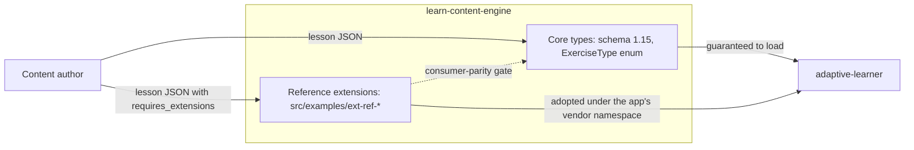
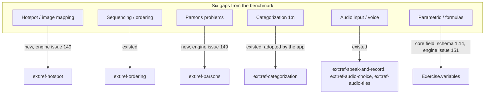
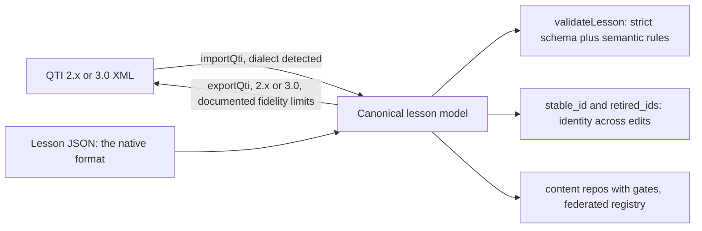
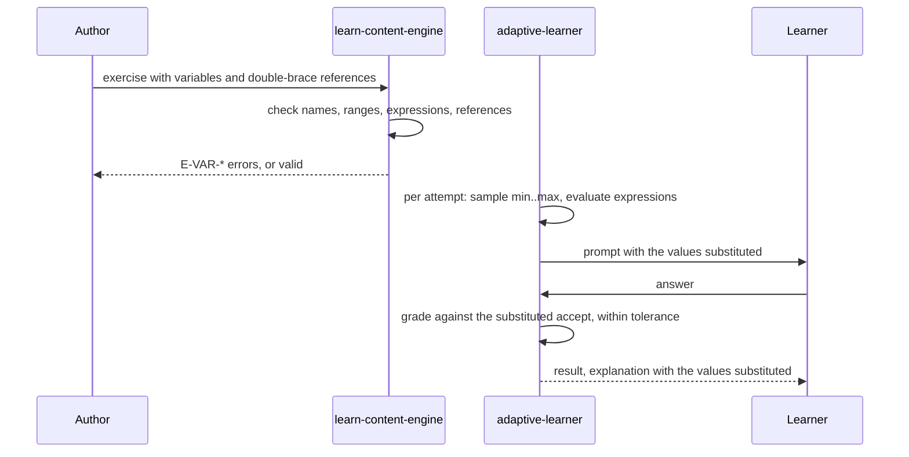
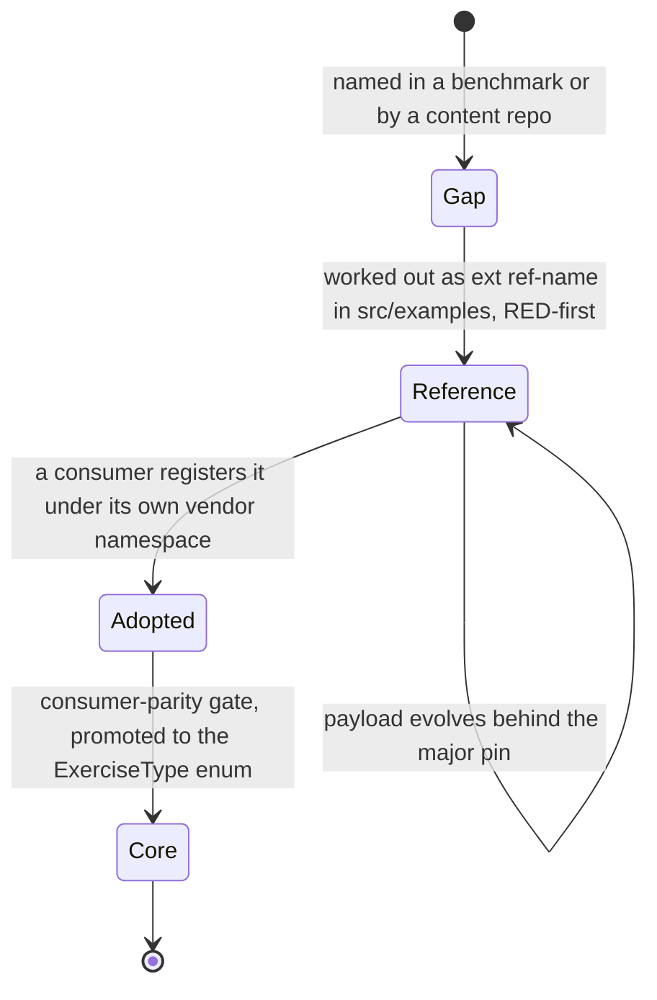
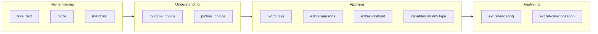
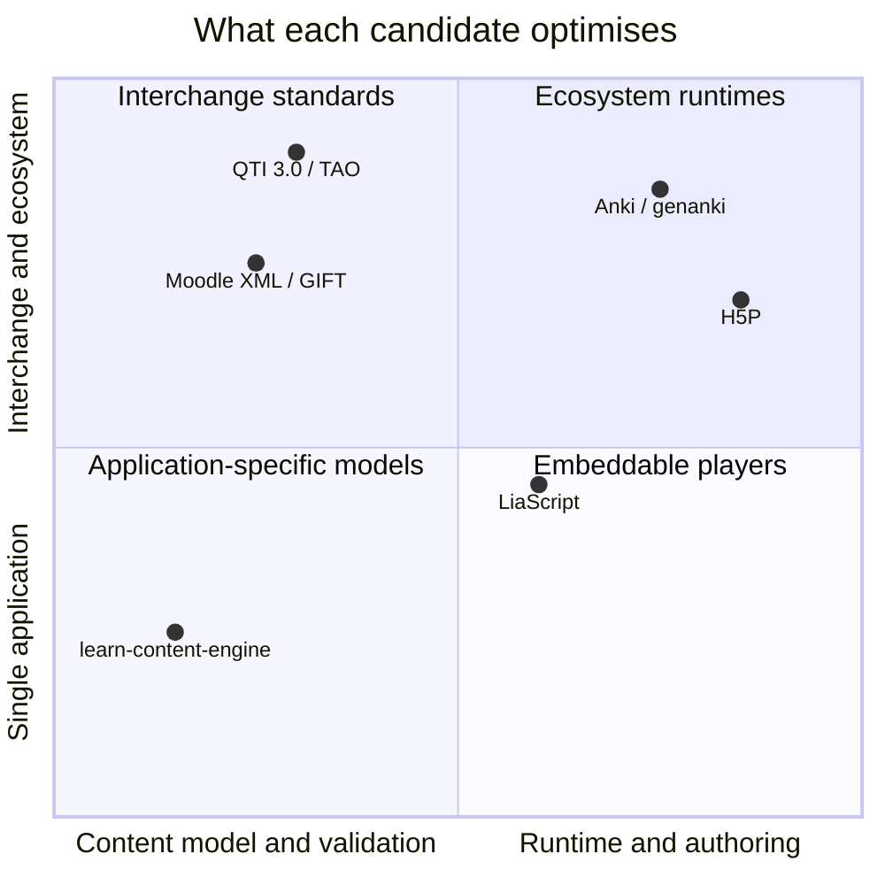

# **Comparative Analysis of Exercise Types in E-Learning Platforms**
**Benchmark Study for the `learn-content-engine` (package 0.28.0, lesson schema currently 1.16)**

**Version:** 1.9  
**Date:** September 23, 2026  
**Author:** Asterios Raptis (astrapi69)  
**Project:** learn-content-engine / adaptive-learner  
**License:** MIT

---

## **Executive Summary**

This document presents a systematic comparative analysis of exercise types across established e-learning platforms (Moodle, H5P, QTI 3.0, Canvas LMS, Duolingo) in the context of the `learn-content-engine`. Two version numbers matter and are easy to conflate: the npm package is at **0.28.0**, the lesson schema it validates against is currently **1.16** (`x-schema-version` in `schema/lesson.schema.json`). This document benchmarks the schema's exercise types.

The analysis demonstrates that the engine, with its six core exercise types (`matching`, `picture_choice`, `free_text`, `word_tiles`, `cloze`, `multiple_choice`), fully covers the **global standard for text-based foundational assessments**.

The identified gaps (hotspot interactions, sequencing/ordering tasks, Parsons problems, categorization, audio input) are not architectural deficits, but rather the result of a deliberate **Lean-Core Design** decision. The `ext:<vendor>-<name>` extension concept aligns with modern best practices (comparable to QTI 3.0 Portable Custom Interactions) and enables the incremental introduction of specialized exercise types without bloating the core schema.

**State of play (version 1.9 of this document; section 9 carries the library-level comparison and a verdict per use case):** on the engine side every row of the matrix is covered. Every one of the five extension gaps has a reference extension under `src/examples/ext-ref-*` (three existed before this document was written: ordering, categorization, three audio variants; hotspot and Parsons were added in response to it, engine#149). The sixth gap, parametric exercises, became a core field in schema 1.14 (`variables`, engine#151, references opt-in since 0.24.1). The interchange boundary speaks QTI 2.x and QTI 3.0 since 0.25.0 (engine#158). What the engine cannot state here is the consumer side: whether `adaptive-learner` has adopted a given extension, and at which pin it runs, is that repository's business and no test here can hold a claim about it. The work was tracked as adaptive-learner#3108 (engine pin and schema mirror), adaptive-learner#3109 (the sampling, substitution and grading half of `variables`) and adaptive-learner#3110 (hotspot, Parsons and ordering under the app's vendor namespace); follow the issues for their status.

**Recommendation:** work the three adaptive-learner issues in that order; #3109 and #3110 depend on the pin from #3108. Nothing further is needed on the engine side for the types in this analysis.

---

## **1. Introduction and Objectives**

### 1.1 Background
The `learn-content-engine` serves as a framework-agnostic TypeScript engine for parsing and validating learning content for the adaptive learning ecosystem (`adaptive-learner`, `alc-*` domain repositories). With over 28 production sets across domains such as language, programming, psychology, and traffic knowledge, there is a need for a well-founded positioning within the e-learning standards landscape.

### 1.2 Objectives
- **Benchmarking:** Systematic comparison of functional coverage of exercise types.
- **Gap Analysis:** Identification of didactically and technically relevant gaps.
- **Architectural Evaluation:** Assessment of the `ext:` extension concept in the context of established standards, including their licensing and accessibility.
- **Roadmap Recommendations:** Prioritized action items for future development.

### 1.3 Methodology
The comparison is based on the analysis of official documentation and specifications of the reference systems (as of 2026). Evaluation is conducted along three dimensions:
1. **Didactic Reach** (Bloom's Taxonomy: Remembering, Understanding, Applying, Analyzing)
2. **Technical Complexity** (Schema declaration vs. Runtime execution)
3. **Domain Relevance** (Alignment with `alc-*` repositories)

---

## **2. Detailed Platform Analysis**

### 2.1 Moodle
**Characteristics:** Classic LMS with a plugin-based architecture, widely used in higher education.

**Core Exercise Types:**
- **Multiple-Choice / Single-Choice:** With optional partial credit scoring.
- **True/False:** Binary decision questions.
- **Short Answer:** Text input checked against wildcard patterns.
- **Numerical:** Mathematical input with an allowed tolerance range (e.g., 10.5 plus or minus 0.2).
- **Cloze (Embedded Answers):** Fill-in-the-blanks within running text.
- **Matching:** 1:1 pairing of items.
- **Essay:** Requires manual grading by instructors.
- **Calculated:** Parametric math questions with randomized variables.

**Extended Plugins:**
- **Drag and Drop onto Image:** Target zone marking on graphics.
- **STACK:** Computer Algebra System (Maxima) integration for symbolic mathematics.

**Assessment:** Moodle comprehensively covers the cognitivist standard but suffers from technical debt due to its monolithic core. The plugin system allows extensions but leads to ecosystem fragmentation.

---

### 2.2 H5P (HTML5 Package)
**Characteristics:** Open-source framework for interactive, media-centric learning content.

**Visual and Spatial Types:**
- **Image Hotspots:** Interactive info points with popups (text, audio, image).
- **Find the Hotspot(s):** Assessment tasks requiring clicks on specific image areas.
- **Image Pairing:** Matching images to images or images to text.
- **Image Choice:** Selecting one or more graphics as an answer.

**Text and Structure Interactions:**
- **Drag the Words:** Drag-and-drop words into text gaps.
- **Fill in the Blanks:** Manual text input.
- **Mark the Words:** Direct clicking/highlighting of correct words in a text (e.g., "Mark all verbs").

**Sequencing:**
- **Sort the Paragraphs:** Arranging paragraphs in a logical order.

**Audio/Speech:**
- **Speak the Words Set:** Web Speech API for pronunciation checks.

**Assessment:** H5P is the market leader for visual interactivity. However, it is designed as a content format, not a strict validation engine like the `learn-content-engine`.

---

### 2.3 QTI 3.0 (IMS Question and Test Interoperability)
**Characteristics:** The international standard for exchanging assessment items (IMS Global Learning Consortium, 1EdTech).

**Interaction Types (Excerpt):**
- **Choice Interaction:** Standard Multiple/Single-Choice.
- **Text Entry Interaction:** Simple fill-in-the-blank.
- **Extended Text Interaction:** Essay input.
- **Hotspot Interaction:** Geometric regions (Circle, Rect, Poly) on an image.
- **Select Point Interaction:** Exact coordinate (x, y) clicks.
- **Graphic Associate Interaction:** Connecting object pairs on an image.
- **Graphic Order Interaction:** Visually arranging objects.
- **Graphic Gap Match Interaction:** Drag-and-drop image elements into target zones.
- **Order Interaction:** Linear sorting of a list.
- **Match Interaction:** n:m matrix matching.
- **Portable Custom Interaction (PCI):** Interface for arbitrary custom extensions.

**Assessment:** QTI 3.0 is the most comprehensive standard but is highly complex (XML-based). Its **PCI concept** is the direct equivalent of the `learn-content-engine`'s `ext:` pattern.

---

### 2.4 Canvas LMS (New Quizzes)
**Characteristics:** Modern higher-education LMS focusing on usability and streamlined workflows.

**Core Types:**
- **Categorization:** 1:n drag-and-drop assignment into category buckets.
- **Formula:** Parametric math questions with variables.
- **Hot Spot:** Image-based target zone tasks.
- **Matching:** Dropdown or drag-based pair matching.
- **Ordering:** Vertical drag-and-drop sorting of lists.
- **File Upload:** Submission of files (PDF, code, ZIP) as a solution.
- **Stimulus:** A complex type where a main medium (e.g., long source code, article, or video) is fixed on the page with multiple sub-questions alongside it.

**Assessment:** Canvas deliberately reduces complexity in favor of intuitive operation. **Categorization (1:n)** is a didactically valuable type for taxonomies.

---

### 2.5 Duolingo
**Characteristics:** Gamified language learning app optimized for micro-interactions and rapid feedback loops.

**Types:**
- **Word Bank / Word Tiles:** Sentence construction from provided building blocks (equivalent to `word_tiles`).
- **Translate:** Bidirectional free-text translation.
- **Listen and Type:** Audio dictation.
- **Listen and Select:** Matching audio snippets to concepts/images.
- **Speak / Pronunciation Check:** Real-time speech recognition with phoneme matching.
- **Character Tracing:** Interactive tracing of characters (e.g., Kanji, Hanzi) on touchscreens.
- **Conversation / Dialogue Completion:** Chat-based role-playing scenarios.

**Assessment:** Duolingo optimizes for low extraneous cognitive load and high engagement through gamification, avoiding complex interactions in favor of didactic efficiency.

---

## **3. Licensing and Accessibility of Reference Systems**

Understanding the licensing models and UI accessibility of these platforms is crucial for evaluating their suitability as architectural references or integration targets.

### 3.1 Moodle
- **License:** **GPLv3+** (GNU General Public License).
- **Open Source:** Yes. Fully free, open-source, and usable for commercial purposes.
- **Publicly Accessible UI:** **Yes**. Moodle provides a freely accessible sandbox environment at [sandbox.moodledemo.net](https://sandbox.moodledemo.net) for learners, educators, and administrators. When self-hosted, the UI is natively included in the core package.

### 3.2 H5P
- **License:** **GPL-3.0** for the core libraries (`h5p-php-library`, `h5p-editor-php-library`); the individual content types and the third-party standalone player (`tunapanda/h5p-standalone`) are **MIT**. (Corrected in version 1.7 of this document; earlier versions called the core MIT.)
- **Open Source:** Yes. Content types are permissively licensed; embedding the core into a proprietary platform is a GPL question. *(Note: H5P.com is the paid SaaS variant, while the underlying framework at H5P.org is open source).*
- **Publicly Accessible UI:** **Yes**. The interactive authoring editor can be tested directly in the browser at [H5P.org](https://h5p.org) (requires a free account). Additionally, free plugins integrate this editor directly into WordPress, Moodle, and Drupal.

### 3.3 QTI 3.0 (IMS Global / 1EdTech)
- **License:** **Open Standard / Free Specification License**.
- **Open Source:** N/A (It is a specification, not software). The specification itself is freely accessible and royalty-free. *(Note: QTI 3.0 is a data format (XML Schema), not a finished software product).*
- **Publicly Accessible UI:** **Indirectly**. Since QTI is a standard, it has no "official" UI. However, open-source authoring tools and players, such as **TAO Testing** (Community Edition) or **Onyx**, provide functional UIs for creating and rendering QTI content.

### 3.4 Canvas LMS
- **License:** **AGPLv3** (Canvas LMS Courseware / Open Source Edition).
- **Open Source:** Yes. The core LMS is available on GitHub. *(Note: Some add-ons and Instructure's hosted cloud infrastructure are proprietary).*
- **Publicly Accessible UI:** **Yes**. Instructure offers a permanent "Free-for-Teacher" account, allowing educators to test the complete UI, including the New Quizzes engine, at no cost.

### 3.5 Duolingo
- **License:** **Proprietary / Commercial Software**.
- **Open Source:** No. Both the source code and the didactic system are protected and commercial.
- **Publicly Accessible UI:** **Yes (Freemium)**. The end-user interface is freely accessible via app and web. *(Note: "Duolingo for Schools" allows teachers to create classrooms for free, but there is no public authoring editor for creating custom, user-generated content).*

### 3.6 Summary Matrix: Licensing and Accessibility

| Tool / Standard | License Model | Open Source? | Freely Accessible UI for Testing? |
| :--- | :--- | :--- | :--- |
| **Moodle** | GPLv3+ | **Yes** | **Yes** ([sandbox.moodledemo.net](https://sandbox.moodledemo.net)) |
| **H5P** | GPL-3.0 core, MIT content types and standalone player | **Yes** | **Yes** ([H5P.org Editor](https://h5p.org)) |
| **QTI 3.0** | Open Standard | *(Specification)* | **Indirectly** (via open-source tools like TAO) |
| **Canvas LMS** | AGPLv3 | **Yes** | **Yes** (Free-for-Teacher Account) |
| **Duolingo** | Proprietary | **No** | **Yes** (App/Web as learner; no authoring tool) |

---

## **4. Comparison Matrix: Exercise Types**

The engine column distinguishes three tiers. **Core** types are in the schema's `ExerciseType` enum and are guaranteed to load in every consumer. **Reference extension** types exist under `src/examples/ext-ref-*` in the engine repository with full validation, a doc-gated example lesson, and a minimal consumer half; they are excluded from the published package and become usable in a given consumer only once that consumer adopts them under its own vendor namespace (`docs/extensions.md`). **Missing** means neither; as of schema 1.14 no row is Missing.



| **Exercise Type Category** | **Moodle** | **H5P** | **QTI 3.0** | **Duolingo** | **learn-content-engine (schema currently 1.16)** |
|----------------------------|------------|---------|-------------|--------------|----------------------------------|
| **Multiple / Single Choice** | ✓ | ✓ | ✓ | ✓ | ✓ Core (`multiple_choice`, `picture_choice`) |
| **Fill-in-the-Blank (Cloze)** | ✓ | ✓ | ✓ | ✓ | ✓ Core (`cloze`) |
| **Matching (1:1)** | ✓ | ✓ | ✓ | ✗ | ✓ Core (`matching`) |
| **Short Answer (Free Text)** | ✓ | ✓ | ✓ | ✓ | ✓ Core (`free_text`) |
| **Word Tiles / Word Bank** | ✗ | ✓ | ✗ | ✓ | ✓ Core (`word_tiles`) |
| **Hotspot / Image Mapping** | (Plugin) | ✓ | ✓ | ✗ | Reference extension (`ext:ref-hotspot`, engine#149) |
| **Sequencing / Ordering** | (Plugin) | ✓ | ✓ | ✗ | Reference extension (`ext:ref-ordering`) |
| **Parsons Problems (Code)** | (Plugin) | ✗ | ✗ | ✗ | Reference extension (`ext:ref-parsons`, engine#149) |
| **Categorization (1:n)** | (Plugin) | ✓ | ✓ | ✗ | Reference extension (`ext:ref-categorization`) |
| **Audio Input / Voice** | ✗ | ✓ | ✗ | ✓ | Reference extensions (`ext:ref-speak-and-record`, `ext:ref-audio-choice`, `ext:ref-audio-tiles`) |
| **Parametric / Formulas** | ✓ | ✗ | ✓ | ✗ | ✓ Core (`variables` on any exercise, schema 1.14, engine#151) |

**Legend:**  
✓ = Native support  
✗ = Not available  
(Plugin) = Extensible via plugin system

---

## **5. Gap Analysis for `learn-content-engine`**

### 5.1 Identified Gaps (Prioritized)

Each entry below carries one example lesson. The examples are copies of the reference lessons in `docs/extensions.md`, where they are validated by the engine's doc gate (`src/docs-extensions-examples.test.ts`); this document is not gate-scanned, so the copies here are illustrative and the copies there are authoritative.

Where each of the six gaps landed:



#### **Priority 1: Hotspot / Image Mapping**
- **Status:** Reference extension `ext:ref-hotspot` (`src/examples/ext-ref-hotspot/`, engine#149).
- **Didactic Value:** High for visual domains (`alc-traffic-knowledge`, `alc-technology`, `alc-dog-training`).
- **Bloom's Level:** Applying, Analyzing.
- **Technical Complexity:** Medium (Schema declaration is simple; consumer rendering requires Canvas/SVG).
- **Reference Implementation:** QTI 3.0 Hotspot Interaction, H5P Find the Hotspot.
- **Design:** `rect` and `circle` zones in percentage coordinates (0-100), so the payload is resolution-independent; exactly one zone correct, mirroring `picture_choice`; graded by point-in-zone hit test with inclusive edges.

```json
{
  "id": "verkehrszeichen-erkennen",
  "title": "Verkehrskunde: Verkehrszeichen erkennen",
  "requires_extensions": ["ext:ref-hotspot@1"],
  "steps": [
    {
      "id": "s1",
      "type": "exercise",
      "exercise": {
        "id": "e1",
        "type": "ext:ref-hotspot",
        "prompt": "Tippe auf das Zeichen, das Vorfahrt gewaehren bedeutet",
        "ext_payload": {
          "src": "assets/images/kreuzung-schilder.png",
          "zones": [
            { "shape": "rect", "coords": [8, 12, 18, 18] },
            { "shape": "rect", "coords": [40, 10, 18, 18], "is_correct": "true" },
            { "shape": "circle", "coords": [78, 20, 9] }
          ]
        }
      }
    }
  ]
}
```

#### **Priority 2: Sequencing / Ordering**
- **Status:** Reference extension `ext:ref-ordering` (`src/examples/ext-ref-ordering/`), the engine's first worked extension.
- **Didactic Value:** High for procedural knowledge (algorithms, traffic procedures, chronologies).
- **Bloom's Level:** Understanding, Applying.
- **Technical Complexity:** Low-Medium (Array-based validation).
- **Reference Implementation:** Canvas Ordering, QTI 3.0 Order Interaction.
- **Design:** `items` in their correct order, at least two, unique (a duplicate makes the order ambiguous); the consumer shuffles.

```json
{
  "id": "anfahren-am-berg",
  "title": "Verkehrskunde: Anfahren am Berg",
  "requires_extensions": ["ext:ref-ordering@1"],
  "steps": [
    {
      "id": "s1",
      "type": "exercise",
      "exercise": {
        "id": "e1",
        "type": "ext:ref-ordering",
        "prompt": "Bringe die Schritte in die richtige Reihenfolge",
        "ext_payload": {
          "items": [
            "Handbremse anziehen",
            "Kupplung treten und ersten Gang einlegen",
            "Kupplung bis zum Schleifpunkt kommen lassen",
            "Gas geben und Handbremse loesen"
          ]
        }
      }
    }
  ]
}
```

#### **Priority 3: Parsons Problems**
- **Status:** Reference extension `ext:ref-parsons` (`src/examples/ext-ref-parsons/`, engine#149).
- **Didactic Value:** Very high for `alc-programming` (reduces syntax frustration, focuses on logic).
- **Bloom's Level:** Applying, Analyzing.
- **Technical Complexity:** Medium (Specialized ordering with indentation checking).
- **Reference Implementation:** Niche; no direct equivalent in major reference systems.
- **Academic Basis:** Denny et al. (2008) prove significantly better learning outcomes compared to free-text code tasks.
- **Design:** `lines` in their correct order, each with a 0-based `indent`; graded on order AND indentation. Deliberately no uniqueness rule, unlike ordering: real programs repeat statements, and a Parsons UI identifies tiles by position, not by text.

```json
{
  "id": "python-funktion-zusammensetzen",
  "title": "Python-Grundlagen: Funktion zusammensetzen",
  "requires_extensions": ["ext:ref-parsons@1"],
  "steps": [
    {
      "id": "s1",
      "type": "exercise",
      "exercise": {
        "id": "e1",
        "type": "ext:ref-parsons",
        "prompt": "Bringe die Zeilen in die richtige Reihenfolge und Einrueckung",
        "ext_payload": {
          "language": "python",
          "lines": [
            { "code": "def begruessung(name):", "indent": 0 },
            { "code": "if name:", "indent": 1 },
            { "code": "return f\"Hallo {name}\"", "indent": 2 },
            { "code": "return \"Hallo\"", "indent": 1 }
          ]
        }
      }
    }
  ]
}
```

#### **Priority 4: Categorization (1:n)**
- **Status:** Reference extension `ext:ref-categorization` (`src/examples/ext-ref-categorization/`); already adopted by `adaptive-learner` as `ext:al-categorization` and in use in several `alc-*` repositories.
- **Didactic Value:** Medium-High for taxonomies (psychology, biology, language classification).
- **Bloom's Level:** Analyzing, Evaluating.
- **Technical Complexity:** Medium (Similar to matching, but with grouping).
- **Reference Implementation:** Canvas Categorization, QTI 3.0 Graphic Gap Match.
- **Design:** `categories` with their correct `items`; at least two categories, every item in exactly one; the consumer shuffles the combined pool.

```json
{
  "id": "hunde-signale-einordnen",
  "title": "Hundetraining: Signale einordnen",
  "requires_extensions": ["ext:ref-categorization@1"],
  "steps": [
    {
      "id": "s1",
      "type": "exercise",
      "exercise": {
        "id": "e1",
        "type": "ext:ref-categorization",
        "prompt": "Ordne jedes Signal der richtigen Kategorie zu",
        "ext_payload": {
          "categories": [
            {
              "name": "Sichtzeichen",
              "items": ["flache Hand senken", "Zeigefinger hoch", "Handflaeche zeigen"]
            },
            {
              "name": "Hoerzeichen",
              "items": ["Sitz", "Platz", "Hier"]
            },
            {
              "name": "Koerpersprache",
              "items": ["sich abwenden", "in die Hocke gehen"]
            }
          ]
        }
      }
    }
  ]
}
```

#### **Priority 5: Audio Input**
- **Status:** Three reference extensions cover the audio stimulus and production space: `ext:ref-speak-and-record` (hear a sentence, reveal it, record yourself; deliberately ungraded), `ext:ref-audio-choice` (gapped sentence, pick the audio clip that fills it), `ext:ref-audio-tiles` (hear a sentence, build its translation from tiles). `ext:ref-dictation` (hear, type) is the fourth member of the family.
- **Didactic Value:** High for the language domain (`adaptive-learner-content`).
- **Bloom's Level:** Applying (Production).
- **Technical Complexity:** High for GRADED speech (requires Web Speech API or external STT, strictly consumer-side); low for the ungraded record-for-self-review shape shipped here.
- **Reference Implementation:** Duolingo Speak, H5P Speak the Words Set.
- **Design:** The engine validates only the shape of `sentence` and the optional `audio` reference; capturing, storing and reviewing the learner's own recording is consumer-side.

```json
{
  "id": "hunde-nachsprechen",
  "title": "Hundetraining: Nachsprechen",
  "requires_extensions": ["ext:ref-speak-and-record@1"],
  "steps": [
    {
      "id": "s1",
      "type": "exercise",
      "exercise": {
        "id": "e1",
        "type": "ext:ref-speak-and-record",
        "prompt": "Hoere den Satz, zeige ihn dir an und nimm dich selbst auf.",
        "ext_payload": {
          "sentence": "Sitz, bitte, sofort.",
          "audio": "assets/audio/sitz-bitte-sofort.mp3"
        }
      }
    }
  ]
}
```

---

### 5.2 Architectural Evaluation

#### **Strengths of `learn-content-engine`**
1. **Lean-Core Design:** No schema bloat; focused on proven standard types.
2. **Extension Architecture:** `ext:<vendor>-<name>` aligns with QTI 3.0 PCI principles, enabling incremental expansion.
3. **Consumer Parity:** Clear separation of schema declaration (Engine) and runtime execution (`adaptive-learner`).
4. **Domain Flexibility:** The `domain` field enables usage beyond language learning (programming, psychology, traffic knowledge).

#### **Weaknesses / Risks**
1. **Parametric Tasks, first cut only:** `variables` (schema 1.14, engine#151) covers the Moodle Calculated / Canvas Formula shape with a deliberately small expression language (arithmetic, parentheses, unary minus) and exercise-level variables. Not covered yet, all additive: lesson-level shared variables, non-uniform distributions, functions and powers in expressions.
2. **No Complex Mathematics:** No symbolic evaluation (like STACK in Moodle).
3. **No Graded Speech Input:** The core has no audio field at all (engine#68's decision); the reference extensions cover audio stimulus and ungraded recording; grading a recording (STT, phoneme matching) remains consumer-side and unimplemented.

### 5.3 Why not QTI 3.0 or H5P as the native format

The matrix invites a question the first versions of this document did not ask: the six core types and the twelve reference extensions all exist elsewhere, so why a format of its own instead of adopting one? Because the exercise-type vocabulary is table stakes, not the product. Every platform in section 2 has multiple choice, cloze and matching; what differs is what the format guarantees around them.

What the engine's format provides that none of the five offer as a library:

1. **A strict schema plus a semantic rule layer.** `additionalProperties: false` everywhere, and rules with stable, documented ids (`E-CLOZE-MARKERS`, `E-MC-ONE-CORRECT`, `E-VAR-UNDEFINED`) that a content repository runs in CI without the application. An item with a blank count that does not match its markers is valid QTI and valid H5P; here it is `E-CLOZE-MARKERS`.
2. **Stable identity.** `stable_id` and `retired_ids` let learner progress and SRS scheduling survive content edits and retirements. QTI item identifiers are per package; H5P content carries no identity across versions.
3. **Content as git repositories.** Ten repositories with gates (validate, lint, stable-ids, schema drift) and a federated registry (`recommended-repos.json`, `search-index.json`). That needs a text format that diffs line by line and a schema the repository can mirror byte-for-byte.
4. **A portability contract for extensions.** Declared per lesson, pinned to a major, refused loudly when a consumer lacks it (`E-EXT-UNSUPPORTED`). The core enum stays the portable authority.

QTI 3.0 as the native format would have bought interoperability with LMS authoring tools and cost all four: it is XML (poor diffs, no strict-shape equivalent), it has no semantic-rule layer, it models tests and items rather than lessons with theory steps and cards, and its Portable Custom Interaction mechanism is the same idea as `ext:` but with a JavaScript runtime contract the engine deliberately does not carry. H5P is a runtime (content type plus player) under MIT; adopting it would have handed the app finished renderers, and with them H5P's packaging, its lack of cross-version identity, and a dependency on the player for every exercise, in an application whose exercise components are small and SRS-integrated.

The interoperability need is real and is met at the boundary rather than in the core. The QTI adapter (`docs/qti.md`) maps the mappable subset in both directions at the same source-to-canonical seam every source adapter uses, in the QTI 2.x and, since engine 0.25.0, the QTI 3.0 dialect (detected on import, chosen on export), and refuses unsupported interactions loudly (`QtiImportError` with the per-item list). Its fidelity limits are documented: theory steps, cards, hints and examples do not cross; scoring, timing and shuffle are not preserved.



So the wheel is reused where it turns, at interchange, and owned where it carries weight: validation, identity, federation.

---

## **6. Recommendations for Future Development**

Engine side: done for every row of the matrix. What follows is the consumer side in `adaptive-learner` and two engine items that stay deliberately open.

### 6.1 Consumer adoption in `adaptive-learner`

These are the consumer tasks the analysis implies, each tracked in that repository. This document deliberately does not report their status: a statement about another repository's state cannot be held by any test here, and the earlier version of this section drifted for exactly that reason. Open the issues for where they stand.

1. **[adaptive-learner#3108](https://github.com/astrapi69/adaptive-learner/issues/3108):** pin the engine and mirror the lesson schema. Prerequisite for the other two; no behaviour change by itself.
2. **[adaptive-learner#3109](https://github.com/astrapi69/adaptive-learner/issues/3109), consumer half of `variables`.** One renderer-agnostic step per attempt: sample, evaluate expressions in declaration order, substitute every `{{name}}`, grade a numeric answer within its variable's `tolerance`, record the drawn values. An exercise without `variables` passes through byte-identical.
3. **[adaptive-learner#3110](https://github.com/astrapi69/adaptive-learner/issues/3110), adopt `ext:ref-hotspot`, `ext:ref-parsons` and `ext:ref-ordering`** as `ext:al-hotspot`, `ext:al-parsons`, `ext:al-ordering`, mirroring the dictation adoption. Target content: `alc-traffic-knowledge` (hotspot, ordering), `alc-programming` (Parsons), `alc-technology` (ordering). Engine halves: `refHotspotExtension`, `refParsonsExtension`, `refOrderingExtension`, all shipped.

### 6.2 Content
4. **Extend `ext:al-categorization` usage:** already adopted; target further repositories (`alc-psychology`, `alc-dog-training`).
5. **First parametric lessons** once #3109 lands: `alc-programming` and `alc-technology` are the natural homes.

### 6.3 Deliberately open on the engine side
6. **Parametric Tasks, consumer side:** the schema contract shipped in 1.14 (engine#151: a `variables` block with ranges, computed expressions and tolerance, `{{name}}` references in core string fields, the engine validates and never evaluates). The flow the app implements in #3109:


7. **Graded Audio Input:** STT service integration on top of `ext:ref-speak-and-record` (strictly Consumer responsibility).
8. **Wider QTI mapping:** `word_tiles` to the order interaction, `ext:ref-hotspot` to the hotspot interaction, both now possible in the 2.x and 3.0 dialects, both waiting for a concrete QTI consumer per the non-goal in `docs/qti.md`.

### 6.4 Architectural Principles for Extensions

The life of an exercise type, from gap to core:



1. **Separation of Concerns:** Core schema (`prompt`, `hint`, `explanation`) remains untouched; extensions define only `ext_payload`. No extension adds a `$defs` entry to `lesson.schema.json`.
2. **Reference First:** A new type is worked out as `ext:ref-<name>` in `src/examples/` (engine half, consumer half, tests, doc-gated example lesson) before any consumer commits to it.
3. **Test-Driven Development (TDD):** Unit tests for validation logic before production release.
4. **Consumer-Parity Gate:** An extension is only promoted to the core `ExerciseType` enum once the `adaptive-learner` provides full support.
5. **Documentation:** Every reference extension has its own section in `docs/extensions.md` with payload rules and a reference lesson.

---

## **7. Didactic Framework**

### 7.1 Bloom's Taxonomy
The core types (schema currently 1.16) primarily cover the lower levels:
- **Remembering:** `free_text`, `cloze`, `matching`
- **Understanding:** `multiple_choice`, `picture_choice`
- **Applying:** `word_tiles` (limited)

The reference extensions systematically unlock higher cognitive levels:
- **Applying:** `ext:ref-parsons`, `ext:ref-hotspot`
- **Analyzing:** `ext:ref-ordering`, `ext:ref-categorization`



> **Reference:** Bloom, B. S. (1956). *Taxonomy of educational objectives: The classification of educational goals*. Longmans, Green.

### 7.2 Cognitive Theory of Multimedia Learning
The visual extensions align with Mayer's **Multimedia Principle**: Learning is more effective when words and pictures are integrated (Mayer, 2021).

> **Reference:** Mayer, R. E. (2021). *Multimedia learning* (3rd ed.). Cambridge University Press. https://doi.org/10.1017/9781316941355

### 7.3 Constructive Alignment
The extensions enable **Constructive Alignment** (Biggs, 1996): Teaching/learning activities and assessments are directly aligned with the stated learning objectives.
*Example:* If the objective is "The learner can *apply* the steps of a safe hill start," a Multiple-Choice question only tests recognition, whereas `ext:ref-ordering` requires active construction of the sequence.

> **Reference:** Biggs, J. B. (1996). Enhancing teaching through constructive alignment. *Higher Education, 32*(3), 347-364. https://doi.org/10.1007/BF00138871

---

## **8. Conclusion**

The `learn-content-engine` (package 0.28.0, schema currently 1.16) is in an **excellent strategic position**:
1. **Standard Parity:** The six core exercise types fully cover the global standard for text-based foundational assessments, and the boundary speaks QTI 2.x and QTI 3.0.
2. **Architectural Maturity:** The `ext:` concept matches modern best practices (QTI 3.0 PCI) and prevents schema bloat.
3. **Didactic Growth Potential:** Every gap this analysis identified is covered, as a reference extension or as the core `variables` field; the higher Bloom levels are reachable without compromising core stability.
4. **Cross-Domain Relevance:** The engine is not limited to language learning; the `domain` field actively supports programming, psychology, traffic knowledge, and more.

**Recommended Next Step:**  
The engine side is complete for the types in this analysis. What a learner can actually play depends on the consumer, which this document does not report on: see the three adaptive-learner issues linked in section 6.1.

---

## **9. Library-Level Comparison: Which Is Better, and for What**

Sections 2 to 4 compare platforms and standards by exercise-type coverage. "Which library is better" is a different question, and only partly a fair one: Moodle and Canvas are learning-management systems, Duolingo is a product, QTI is a specification. This section restricts itself to what a developer could actually adopt instead of `learn-content-engine` to model, validate and exchange lesson content, states the verifiable facts, and gives a verdict per use case. It does not name a single winner, because the candidates optimise different things.

### 9.1 What is comparable

| Candidate | What you get | What it is not |
|---|---|---|
| **`learn-content-engine`** | A lesson format (JSON Schema), a validator with semantic rules and stable rule ids, generated TypeScript types, stable identity across edits, a QTI 2.x / 3.0 adapter, author tooling (mint, migrate, coverage gates). | Not a renderer, not an authoring UI, not a runtime. The consumer owns all three. |
| **QTI 3.0 via TAO Community Edition** (`oat-sa/tao-core`) or **`amp-up-io/qti3-item-player`** | The 1EdTech interchange standard with a full assessment platform (TAO) or a Vue item player. Largest interoperability reach of any option. | Not a lesson model (no theory steps, no cards), no semantic validation beyond XSD, no identity across item versions, XML. |
| **H5P** (`h5p/h5p-php-library`, content types, `tunapanda/h5p-standalone`) | Around fifty finished interactive content types with editor and player, embeddable anywhere. | A runtime and a package format, not a validated data model; no cross-version identity; core is GPL-3.0. |
| **LiaScript** (`LiaScript/LiaScript`) | Courses as Markdown with inline quizzes, surveys and code, plus an interpreter/player; git-friendly text; free hosting via the LiaScript viewer. | Quizzes are inline syntax, not a typed schema you can validate or query; no identity, no SRS, player is Elm. |
| **Anki deck format via `kerrickstaley/genanki`** | The largest spaced-repetition ecosystem there is, with a Python library to build decks. | Cards, not typed exercises; no validator; identity is Anki's note id; the format is an SQLite package. |
| **Moodle XML / GIFT** | Teacher-facing question formats every Moodle instance imports. | Formats inside Moodle (GPL-3.0, PHP); no standalone library; question bank semantics, not lessons. |

Excluded on purpose: Learnosity (proprietary, no public source), Open edX OLX (bound to the platform), SCORM and xAPI (packaging and tracking, not content models).

### 9.2 Facts (GitHub API, 2026-09-16)

| Repository | License | Language | Stars | Last push | Maintenance |
|---|---|---|---|---|---|
| `astrapi69/learn-content-engine` | MIT | TypeScript | 1 | 2026-09-16 | one maintainer (148 of 153 commits), AI-assisted |
| `h5p/h5p-php-library` | GPL-3.0 | PHP | 150 | 2026-09-15 | H5P Group |
| `tunapanda/h5p-standalone` | MIT | TypeScript | 343 | 2026-03-24 | community |
| `LiaScript/LiaScript` | BSD-3-Clause | Elm | 282 | 2026-09-15 | small team (TU Freiberg origin) |
| `oat-sa/tao-core` | GPL-2.0 | PHP | 64 | 2026-09-15 | Open Assessment Technologies |
| `amp-up-io/qti3-item-player` | MIT | Vue | 30 | 2025-06-21 | one company |
| `kerrickstaley/genanki` | MIT | Python | 2701 | 2024-12-30 | one maintainer |
| `ankitects/anki` | AGPL-3.0 (own LICENSE file) | Rust | 30612 | 2026-09-16 | Anki team |
| `moodle/moodle` | GPL-3.0 | PHP | 7410 | 2026-09-16 | Moodle HQ and community |

Runtime footprint of `learn-content-engine`: three dependencies (`yaml`, `ajv`; `@rgrove/parse-xml` only behind the `/qti` subpath), 1146 tests, no framework. Stars measure attention, not quality, but they are the honest proxy for the size of the community that will answer a question or fix a bug.

### 9.3 Criteria

| Criterion | learn-content-engine | QTI 3.0 (TAO, item player) | H5P | LiaScript | Anki / genanki | Moodle XML / GIFT |
|---|---|---|---|---|---|---|
| Typed content model with strict schema | yes (`additionalProperties: false`) | XSD, permissive | package manifest, per-type JSON, no strictness contract | no (Markdown grammar) | no | no |
| Semantic validation with stable rule ids | yes (`E-*`, `W-*`, documented) | no | no | no | no | no |
| Identity across content edits | yes (`stable_id`, `retired_ids`) | per package identifier | no | no | note id | no |
| Git-friendly text format | yes (JSON, YAML) | XML, workable | zipped packages | best in class (Markdown) | SQLite in a zip | XML / plain text |
| Extension contract | yes (`ext:` namespace, declared, pinned, refused loudly) | PCI (JS runtime contract) | content types (JS runtime) | inline macros | no | no |
| LMS interchange | via QTI adapter, mappable subset | native, the standard | via LTI / plugins | export to SCORM / IMS | no | native for Moodle |
| Finished renderers | no | TAO, item player | yes, around fifty | yes, the player | Anki clients | Moodle |
| Authoring UI in the package | no (the consumer app has one) | TAO | yes | any text editor plus live preview | Anki desktop | Moodle |
| Spaced-repetition fit | designed for it (identity, per-element ids) | no | no | no | the reference | no |
| Federation of content repositories | yes (registry, search index, gates) | no | H5P Hub (central) | no | AnkiWeb shared decks (central) | no |
| Community size | very small | large (assessment industry) | large | medium | very large | very large |
| Bus factor | one person | organisations | organisation | small team | one person (genanki), team (Anki) | organisation |

### 9.4 Verdict, by use case

1. **You run or integrate with an LMS and need interchange.** QTI 3.0 through TAO or an item player, or Moodle XML for Moodle. `learn-content-engine` only bridges to QTI for its mappable subset; it is not a substitute.
2. **You want finished interactive content with an editor, embedded in an existing site.** H5P, with the GPL-3.0 core license as the one thing to check. `learn-content-engine` ships no renderer at all.
3. **You write courses as text and want a free player.** LiaScript is the closest in spirit (git, Markdown, open license) and better at author ergonomics; it gives up typed validation, identity and SRS, which is fine for a course and not fine for a drill app.
4. **You need spaced repetition at scale with an existing community.** Anki plus genanki. Cards rather than typed exercises, and no validator, but thirty thousand stars of ecosystem.
5. **You build your own learning application and need a strict, validated, versioned content format, content maintained in git with CI gates, identity that survives edits, and a federation of content repositories.** `learn-content-engine`. It is the only candidate built as a library for exactly this, and the only one with semantic rules and stable ids. Its weaknesses are not in the design: one consumer, one maintainer, one star, no renderer, no authoring UI in the package. A team choosing it takes on the bus factor and the ecosystem size; the mitigations are the ones already in place (strict gates, byte-pinned schema mirrors, documented contracts, a docs site), and they do not remove the risk.

Objective summary: there is no better library in general. Each candidate wins the use case it was built for, and `learn-content-engine` wins exactly one, the fifth, which is the one this ecosystem has. The trade it makes for that fit is size. That is the fair sentence to put in front of anyone deciding.



---

## **References**

Biggs, J. B. (1996). Enhancing teaching through constructive alignment. *Higher Education, 32*(3), 347-364. https://doi.org/10.1007/BF00138871

Bloom, B. S. (1956). *Taxonomy of educational objectives: The classification of educational goals*. Longmans, Green.

Denny, P., Luxton-Reilly, A., and Simon, B. (2008). Evaluating a new exam question: Parsons problems. *Proceedings of the Fourth International Workshop on Computing Education Research*, 113-124. https://doi.org/10.1145/1404520.1404531

IMS Global Learning Consortium (1EdTech). (2023). *QTI 3.0 Best Practices and Implementation Guide*. https://www.imsglobal.org/spec/qti/v3p0

Mayer, R. E. (2021). *Multimedia learning* (3rd ed.). Cambridge University Press. https://doi.org/10.1017/9781316941355

---

## **Appendix A: Technical References**

- **learn-content-engine Repository:** https://github.com/astrapi69/learn-content-engine
- **adaptive-learner (Reference Consumer):** https://github.com/astrapi69/adaptive-learner
- **Extension tier:** `docs/extensions.md` (portability contract, every reference extension with payload rules and a doc-gated example lesson)
- **Domain Repositories:** 
  - `alc-programming`: https://github.com/astrapi69/alc-programming
  - `alc-traffic-knowledge`: https://github.com/astrapi69/alc-traffic-knowledge
  - `alc-psychology`: https://github.com/astrapi69/alc-psychology
  - `alc-technology`: https://github.com/astrapi69/alc-technology
- **Schema Documentation:** https://astrapi69.github.io/learn-content-engine/schema/lesson.schema.json

---
