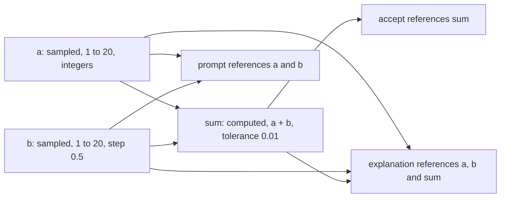

# Lesson format reference

This is the complete, self-contained reference for the content format
`learn-content-engine` parses and validates. You do **not** need the Adaptive
Learner app to author or validate a lesson: everything the format allows is
described here, and every `json` example below is extracted by a test and run
through `validateLesson` / `validateManifest`, so no example can drift from the
engine.

The canonical schema ships in the package at
[`schema/lesson.schema.json`](../schema/lesson.schema.json) (lessons) and
[`schema/content-manifest.schema.json`](../schema/content-manifest.schema.json)
(manifests). The schema is **strict**: unknown fields are rejected. See
[validation.md](validation.md) for the rules and error model.

- [A lesson at a glance](#a-lesson-at-a-glance)
- [Lesson meta fields](#lesson-meta-fields)
- [Cards](#cards)
- [Steps](#steps)
  - [Theory steps](#theory-steps)
  - [Inline examples and example links](#inline-examples-and-example-links)
- [Exercises](#exercises)
  - [matching](#matching)
  - [picture_choice](#picture_choice)
  - [free_text](#free_text)
  - [word_tiles](#word_tiles)
  - [cloze](#cloze) (`type`, `select`, `multiselect`)
  - [multiple_choice](#multiple_choice)
  - [direction](#direction)
- [Manifest format](#manifest-format)
  - [Evaluation](#evaluation)

## A lesson at a glance

A lesson is a single JSON object: some meta fields, an optional list of `cards`
(the facts it teaches), and an ordered list of `steps` (theory to read and
exercises to do). This example is a complete, valid lesson that shows most of
the shape at once:

```json
{
  "id": "01-greetings",
  "title": "Greetings",
  "description": "Say hello in French.",
  "target_language": "fr",
  "source_language": "en",
  "domain": "language",
  "estimated_minutes": 8,
  "cards": [
    { "id": "bonjour", "front": "bonjour", "back": "hello", "tags": ["greeting"] }
  ],
  "steps": [
    {
      "id": "intro",
      "type": "theory",
      "title": "Saying hello",
      "body": "**Bonjour** is the standard daytime greeting.",
      "example_url": "https://example.com/bonjour",
      "example_label": "Watch a clip",
      "examples": [
        { "title": "In a sentence", "content": "Bonjour, comment ca va ?" },
        { "title": "As code", "language": "python", "content": "print('bonjour')" }
      ]
    },
    {
      "id": "drill",
      "type": "exercise",
      "exercise": {
        "id": "drill-1",
        "type": "free_text",
        "prompt": "How do you greet someone during the day?",
        "direction": "source_to_target",
        "card_ids": ["bonjour"],
        "accept": ["bonjour", "Bonjour"]
      }
    }
  ]
}
```

The required lesson fields are `id`, `title`, and a non-empty `steps` array.
Everything else is optional.

## Lesson meta fields

| Field | Type | Notes |
|---|---|---|
| `id` | string, required | [Slug id](#slug-ids), unique within the set. Its lexicographic sort IS the display order (see [Lesson ordering](#lesson-ordering)); zero-padded `NN-slug` prefixes (e.g. `01-greetings`) keep it deterministic. |
| `title` | string, required | Human-readable lesson title. |
| `steps` | array, required | Ordered theory + exercise steps; at least one. |
| `cards` | array | The facts the lesson teaches (see [Cards](#cards)). |
| `description` | string \| null | One or two sentence summary. |
| `target_language` | string \| null | BCP-47 code of the language taught. Usually inherited from the set; a standalone export may carry its own. |
| `source_language` | string \| null | BCP-47 code of the language the learner already speaks. |
| `domain` | string \| null | Content domain (`language`, `psychology`, `programming`, ...). Inherited from the set when absent. |
| `estimated_minutes` | integer | 1-240, default 10. |
| `resources` | array \| null | Optional supplementary media ({`type`, `title`, `url`, ...}). |
| `contributed_by`, `contributed_at` | string \| null | Optional author credit. |
| `variation_of`, `variation_note` | string \| null | Marks a lesson as a variation of another. |

`target_language` / `source_language` / `domain` are normally supplied by the
parent set and injected during parsing; a lesson that declares its own keeps
them. See [concepts.md](concepts.md#context-inheritance-vs-standalone).

## Slug ids

`lesson.id`, `step.id`, `exercise.id` and `card.id` share one machine-enforced
shape (schema v1.10, `$defs/SlugId`, engine#105):

```
^[\p{Ll}\p{Nd}]+(-[\p{Ll}\p{Nd}]+)*$
```

Lowercase Unicode letters and digits in hyphen-separated runs. No uppercase,
no underscore, no whitespace, no leading/trailing/double hyphen. Valid:
`01-greetings`, `a`, `fünf-wörter`. Invalid: `A-b`, `a_b`, `a b`, `-a`, `a-`,
`a--b`.

**Diacritics are allowed on purpose, and the rule must stay Unicode-aware.**
`\p{Ll}` covers `ä`, `í`, `ß` and every other lowercase letter, not just
`a-z`. This is not decoration: measured across all eleven content repos at
`origin/main` (582 lessons, 31 334 identifiers), **158 published
identifiers carry non-ASCII lowercase letters** - 15 `step.id`, 12
`exercise.id`, 29 `card.id` and 102 `card.tags`, for example
`ex-match-defining-nondefining-sätze`, `ex-free-veía`, `unregelmäßig`,
`höflichkeit`. Narrowing the rule to `[a-z0-9]` would invalidate all of
them, and the only possible repair would be renaming ids that learner
progress hangs on - the orphaning class this project spent
[stable identity](#stable-identity-stable_id) closing. Before proposing an
ASCII-only slug rule, re-run that measurement; the number is the argument
(engine#115).

The Unicode form costs one thing: Python's built-in `re` cannot compile
`\p{...}`, so a Python-side validator needs the `regex` package. The engine
ships `python/lce_schema.py` for exactly that, so both validators apply the
same rule rather than one of them merely surviving it.

This is exactly the regex the reference consumer
([adaptive-learner](https://github.com/astrapi69/adaptive-learner)) applies on
import; a lesson whose ids fail it is silently skipped there, so the engine
rejects it up front instead of letting a schema-conforming generator produce
content the app throws away. `card.tags` enforces the same rule as a hard
pattern since schema 1.11 (engine#108; the interim `W-ID-NOT-SLUG` warning
tier retired with it, because the published corpus is clean and a lint that
runs only on structurally valid input could never fire again).
`stable_id` keeps its own historical pattern for compatibility (see
[Stable identity](#stable-identity-stable_id)).

## Lesson ordering

The display order of a set's lessons is the **lexicographic sort of their
ids** - nothing else (engine#106). The reference consumer sorts the stored
`lessons/<lesson.id>.json` filenames on read and on zip import; the set
manifest's `metadata.lessons` list only steers which files the downloader
fetches, never the order anything is displayed in.

The `NN-slug` convention (`01-greetings`, `02-numbers`) is therefore the
ordering mechanism, not cosmetics, and the prefix must be zero-padded to one
fixed width per set: without padding, `10-` sorts before `2-`. The same trap
applies to numbers embedded anywhere in the id - a set named
`kapitel-1 ... kapitel-17` displays as `kapitel-1, kapitel-10, ...,
kapitel-2`, which is exactly the observed damage case that motivated this
section.

Because the engine validates one lesson at a time, the set-level check ships
as a helper in the `collectStableIds` style: `lessonIdOrderingIssues(ids)`
returns warning-tier issues (`W-SET-ORDER-MIXED-PREFIX`,
`W-SET-ORDER-PREFIX-WIDTH`, `W-SET-ORDER-NUMERIC`, see the
[rule catalog](#rule-catalog)) for the id shapes that guarantee a wrong
display order. The caller - typically a repo gate - decides which lesson ids
form the set.

The helper also has a built-in carrier (engine#110): `validateManifest`
runs it over a per-set manifest's `metadata.lessons` file list (each entry
minus `.json` is the lesson id) and attaches the warnings at
`/metadata/lessons`. Every repo gate that validates its per-set manifests
therefore carries the ordering check as soon as it pins an engine version
that ships it - no gate-script change needed.

## Cards

A card is the smallest learnable unit: one term / concept / fact. Exercises
reference cards by `id` (see `card_ids`), and every referenced id must exist in
the lesson's `cards` (referential integrity is enforced).

| Field | Type | Notes |
|---|---|---|
| `id` | string, required | [Slug id](#slug-ids), unique within the lesson. |
| `stable_id` | string \| null | Version-stable identity (schema v1.9, see [Stable identity](#stable-identity-stable_id)). |
| `front` | string, required | What the learner sees first (usually the target term). |
| `back` | string, required | What they recall (translation / definition). |
| `tags` | string[] | Tags for filtering; each entry must match the [slug rule](#slug-ids) (hard pattern since schema 1.11, engine#108). |
| `hint`, `notes` | string \| null | Optional help / footnote. |
| `difficulty` | 1-5 \| null | Optional difficulty. |
| `media_type` | `text` \| `code` \| `formula` \| `diagram` \| null | Content kind; drives code-aware rendering. |
| `code_snippet`, `code_language`, `expected_output` | string \| null | For code cards. |
| `image`, `audio` | string \| null | Relative paths inside the set's `assets/`. |
| `token_roles` | array \| null | Optional `{token, role}` grammatical annotations. |

## Steps

A step is either a **theory** step (`type: "theory"`) or an **exercise** step
(`type: "exercise"`). The rules are strict:

- A theory step **requires** a non-empty `body` and must **not** carry an
  `exercise`.
- An exercise step **requires** an `exercise` payload and must **not** carry a
  `body`.

Common step fields: `id` (required, a [slug id](#slug-ids)), `type` (required), `title`.

### Theory steps

A theory step carries Markdown in `body`. It may additionally link out to an
external illustration (`example_url` + optional `example_label`) and/or carry
inline worked examples (`examples`). The two are complementary and may coexist,
as the [glance example](#a-lesson-at-a-glance) shows.

### Inline examples and example links

`examples` is an array of `InlineExample` objects (schema v1.5, additive):

| Field | Type | Notes |
|---|---|---|
| `content` | string, required | The example text, or source code when `language` is set. |
| `language` | string \| null | Highlighter hint (`python`, `sql`, ...). When set, `content` is rendered as a code block; when absent, as plain text. |
| `title` | string \| null | Optional short heading. |

`example_url` (schema v1.4) links **out** to an external article/video;
`examples` carries the example content **inline**. A theory step can use either,
both, or neither. Both are shown together in the glance example above.

## Exercises

An exercise lives inside an exercise step. Every exercise requires `id`, `type`,
and `prompt`. `type` is one of `matching`, `picture_choice`, `free_text`,
`word_tiles`, `cloze`. Each type reads a specific set of fields; the wrong-field-
for-type combinations are rejected (see [validation.md](validation.md)).

Common optional exercise fields: `card_ids` (the cards drilled; each must exist),
`distractors`, `hint`, `direction`, `examples`, `explanation` (schema v1.13,
see [Explanation](#explanation-post-answer)), `variables` (schema v1.14, see
[Variables](#variables-parametric-exercises)), and `stable_id` (schema v1.9,
see [Stable identity](#stable-identity-stable_id)).

### Explanation (post-answer)

`explanation` (string \| null, max 2000 chars, schema v1.13) is Markdown
explaining WHY the answer/grammar is what it is - a French word-order rule, a
grammatical case, a spelling exception. Timing is what distinguishes it from
the other three "extra text" fields:

| Field | Shown | Purpose |
|---|---|---|
| `examples` | Before answering | Worked examples, must not spoil the answer. |
| `hint` | On demand, before/during answering | A nudge behind a "Need a hint?" button. |
| `explanation` | After answering (correct or not) | The reasoning behind the answer. |

Not restricted to any exercise type; an author uses it wherever the "why" adds
value and omits it everywhere else.

#### Writing a good explanation

The field is free Markdown on purpose, so the following is a convention, not
a schema rule (engine#147). It exists so that hand-written and generated
explanations look alike across content repos and so a consumer can render
them consistently. Up to four blocks, in this order; use only the ones that
add something for the exercise at hand:

1. **Rule.** One or two sentences in the learner's `source_language`, naming
   exactly the rule the exercise tests. Not the grammar chapter.
2. **Word for word.** A gloss of the target sentence, one bullet per token:
   `*token* - literal meaning (grammatical note)`. Tokens in
   `target_language`, meanings and notes in `source_language`. This is the
   fastest way for a learner to SEE the syntax instead of reading about it.
3. **Further examples.** Two or three sentences with the same pattern, target
   sentence plus translation. One example reads as a special case, three as a
   pattern.
4. **Typical mistake** (optional). The error speakers of the source language
   tend to make, so the contrast is explicit.

A complete example, Spanish A1 for German speakers, exercise "el coche rojo":

```markdown
**Regel:** Beschreibende Adjektive stehen im Spanischen meist NACH dem Nomen.

**Wort für Wort:**
- *el* - der (Artikel, maskulin Singular)
- *coche* - Auto (Nomen)
- *rojo* - rot (Adjektiv, nachgestellt, richtet sich nach *coche*)

**Weitere Beispiele:**
- *la casa blanca* - das weiße Haus
- *un libro interesante* - ein interessantes Buch

**Typischer Fehler:** *el rojo coche* nach deutschem Muster.
```

Practical notes:

- **Budget.** The example above is about 420 characters; a gloss of a
  ten-token sentence plus three examples plus a typical mistake fits well
  inside the 2000-character limit. If it does not fit, the explanation is
  covering more than one rule.
- **Which exercises.** Anything with a target sentence benefits: `cloze`,
  `word_tiles`, `free_text` translations, `multiple_choice` on grammar. A
  `matching` or `picture_choice` exercise has no sentence to gloss; there the
  explanation is a one-line rule, or absent.
- **Repetition.** When the same rule is tested by many exercises of one
  lesson, keep each explanation to the gloss of ITS sentence plus the short
  rule, and put the long version into the theory step. Ten copies of the same
  400 characters are content duplication and tire the learner.
- **Not only languages.** The rule block applies to any domain (why `const`
  and not `let`, why the derivative is what it is); the gloss and the
  typical-mistake blocks are language-specific and are simply omitted.
- **After the answer, so no spoiler rule.** Unlike `examples` and `hint`, the
  explanation may name the solution freely.

A structured shape (gloss tokens with per-token speech, post-answer examples
reusing `InlineExample`) is deliberately deferred until real content written
under this convention shows what authors actually use; it would be an
additive schema change, tracked separately.

### Variables (parametric exercises)

`variables` (array of `ExerciseVariable` \| null, 1 to 20 entries, schema
v1.14, engine#151) makes one authored exercise stand for many concrete
instances: the consumer draws values per attempt, computes the derived ones,
substitutes every `{{name}}` in the exercise's string fields, and grades
against the substituted answer. This is the shape Moodle calls Calculated,
Canvas calls Formula, and QTI 3.0 models with template variables.

A variable has a `name` (lowercase identifier, unique within the exercise)
and is one of two shapes:

- **Sampled:** `min` and `max` (both inclusive), optional `step`. Without
  `step` the value is an integer in the range; with `step` it is one of
  `min`, `min + step`, `min + 2 step`, ... up to `max`.
- **Computed:** `expression` over variables declared EARLIER in the list.
  The expression language is deliberately small: decimal numbers, variable
  names, `+ - * /`, parentheses, unary minus. No functions, no powers, no
  comparison; it grows additively when content needs it. Optional
  `tolerance` (absolute) is what a consumer applies when this variable's
  value is an accepted answer.

```json
{
  "id": "addition-parametrisch",
  "title": "Addition mit Zufallszahlen",
  "steps": [
    {
      "id": "s1",
      "type": "exercise",
      "exercise": {
        "id": "e1",
        "type": "free_text",
        "prompt": "Was ist {{a}} + {{b}}?",
        "variables": [
          { "name": "a", "min": 1, "max": 20 },
          { "name": "b", "min": 1, "max": 20, "step": 0.5 },
          { "name": "sum", "expression": "a + b", "tolerance": 0.01 }
        ],
        "accept": ["{{sum}}"],
        "explanation": "Die Summe von {{a}} und {{b}} ist {{sum}}."
      }
    }
  ]
}
```

How the three variables of that example depend on each other, and where the
references sit:



The engine validates the contract and never samples or evaluates:

| ID | Rule |
|---|---|
| `E-VAR-KIND` | A variable is a range (`min` and `max`, optional `step`) or an `expression`, never neither, never both. |
| `E-VAR-DUP` | Two variables of one exercise share a `name`. |
| `E-VAR-RANGE` | `min` is not below `max`. |
| `E-VAR-EXPR` | An `expression` does not parse in the language above. |
| `E-VAR-UNDEFINED` | An expression or a `{{reference}}` names a variable the exercise does not declare, or one declared later in the list (so no cycles, no self-reference). |
| `E-VAR-REF` | A `{{...}}` holds something other than a plain name; put the expression into a computed variable and reference that. |
| `W-VAR-UNUSED` | A declared variable is referenced by no field and used by no later expression. |

The consumer side of the contract: substitute in EVERY string field of the
exercise (`prompt`, `accept`, option texts, pairs, `sentence`, `hint`,
`explanation`, `ext_payload`); a numeric accepted answer whose variable
carries `tolerance` grades within that tolerance, otherwise exactly; the
sampled values are the consumer's to record per attempt if a review should
show them. `stable_id` names the authored exercise, not an instance.

Only an exercise that declares `variables` is parametric. There, every
`{{...}}` in its string fields must be a reference. An exercise WITHOUT
`variables` is never scanned, so lessons about templating languages keep
their braces as ordinary text: an Ansible lesson teaching Jinja2 has
`{{ server }}` in its prompt and accepted answers and is not parametric.
A consumer substitutes only on exercises that carry `variables`.

Not restricted to any exercise type. Deferred, all additive: lesson-level
shared variables, non-uniform distributions, and a richer expression
language.

### matching

Match left items to right items. Requires a non-empty `pairs` list of
`{left, right}`.

```json
{
  "id": "match-colors",
  "title": "Match colors",
  "cards": [
    { "id": "rouge", "front": "rouge", "back": "red" },
    { "id": "bleu", "front": "bleu", "back": "blue" }
  ],
  "steps": [
    {
      "id": "s1",
      "type": "exercise",
      "exercise": {
        "id": "m1",
        "type": "matching",
        "prompt": "Match each color to its translation.",
        "card_ids": ["rouge", "bleu"],
        "pairs": [
          { "left": "rouge", "right": "red" },
          { "left": "bleu", "right": "blue" }
        ]
      }
    }
  ]
}
```

**`from_cards`.** To avoid repeating a definition that already lives in the
cards, set `"from_cards": true` and omit `pairs`: the engine builds the pairs
from the referenced cards (left = `front`, right = `back`) at parse time. It
requires non-empty `card_ids` and forbids an explicit `pairs` list.

```json
{
  "id": "match-colors-from-cards",
  "title": "Match colors (from cards)",
  "cards": [
    { "id": "rouge", "front": "rouge", "back": "red" },
    { "id": "bleu", "front": "bleu", "back": "blue" }
  ],
  "steps": [
    {
      "id": "s1",
      "type": "exercise",
      "exercise": {
        "id": "m1",
        "type": "matching",
        "prompt": "Match each color to its translation.",
        "card_ids": ["rouge", "bleu"],
        "from_cards": true
      }
    }
  ]
}
```

### picture_choice

Pick the correct image. Requires at least two `images` (`{src, label,
is_correct?}`), exactly one marked `"is_correct": "true"`. `src` takes one of
two explicit formats (schema v1.8): a relative path inside the set's
`assets/` (up to 500 chars, the right choice for repo content) or an inline
base64 data URI (`data:image/...;base64,...`, own 250000-char cap, sized for
the reference consumer's 150-KiB upload compression). Repo content should
stay on the `assets/` path; the `W-PIC-DATA-URI` author lint flags inline
data URIs. Do **not** use this for text-only multiple choice: use `cloze`
`select` mode for that.

```json
{
  "id": "pick-cat",
  "title": "Pick the cat",
  "steps": [
    {
      "id": "s1",
      "type": "exercise",
      "exercise": {
        "id": "p1",
        "type": "picture_choice",
        "prompt": "Which picture shows a cat?",
        "images": [
          { "src": "assets/img/cat.png", "label": "A cat", "is_correct": "true" },
          { "src": "assets/img/dog.png", "label": "A dog" }
        ]
      }
    }
  ]
}
```

### free_text

Type a short answer. Requires a non-empty `accept` list; the first entry is the
canonical answer, the rest are accepted variants (matching is exact, then
Levenshtein-tolerant).

```json
{
  "id": "greeting-drill",
  "title": "Greeting drill",
  "cards": [
    { "id": "bonjour", "front": "bonjour", "back": "hello" }
  ],
  "steps": [
    {
      "id": "s1",
      "type": "exercise",
      "exercise": {
        "id": "f1",
        "type": "free_text",
        "prompt": "How do you say 'hello' in French?",
        "card_ids": ["bonjour"],
        "accept": ["bonjour", "Bonjour"]
      }
    }
  ]
}
```

### word_tiles

Arrange shuffled tiles into the correct order. Requires at least two `tiles`.
`accept_orderings` is optional; each entry must be a permutation of the tile
indices `[0..n-1]`. Reserve this for sentences with a genuinely unique word
order.

```json
{
  "id": "order-sentence",
  "title": "Build a sentence",
  "steps": [
    {
      "id": "s1",
      "type": "exercise",
      "exercise": {
        "id": "w1",
        "type": "word_tiles",
        "prompt": "Put the words in order to say 'I am here'.",
        "tiles": ["je", "suis", "ici"],
        "accept_orderings": [[0, 1, 2]]
      }
    }
  ]
}
```

### cloze

Cloze has three modes, selected by `cloze_mode` (defaults to `type`).

**`type`**: one `<input>` per blank. Requires a `sentence` with visible `___`
markers and a `blanks` array. The **blanks rule**: the number of `___` markers
in `sentence` must equal `blanks.length` (each blank's `accept` list carries its
answers).

```json
{
  "id": "cloze-verbs",
  "title": "Fill in the verb",
  "steps": [
    {
      "id": "s1",
      "type": "exercise",
      "exercise": {
        "id": "c1",
        "type": "cloze",
        "cloze_mode": "type",
        "prompt": "Complete the sentence.",
        "sentence": "Je ___ etudiant et je ___ ici.",
        "blanks": [
          { "accept": ["suis"] },
          { "accept": ["reste"], "hint": "to stay" }
        ]
      }
    }
  ]
}
```

**`select`**: the single-multiple-choice vehicle, a `<select>` per blank drawn
from `distractors`. Requires `sentence` + `blanks` (same marker rule) **and** a
non-empty `distractors` pool. `accept[0]` of the blank is the correct option.

```json
{
  "id": "cloze-capital",
  "title": "Capital city",
  "steps": [
    {
      "id": "s1",
      "type": "exercise",
      "exercise": {
        "id": "c1",
        "type": "cloze",
        "cloze_mode": "select",
        "prompt": "Choose the correct completion.",
        "sentence": "Paris is the capital of ___.",
        "blanks": [ { "accept": ["France"] } ],
        "distractors": ["Germany", "Spain"]
      }
    }
  ]
}
```

**`multiselect`**: "select all that apply". Here `sentence` is the question
stem (no `___` markers, no `blanks`); `accept` lists **every** correct option
and `distractors` the wrong ones. The two lists must be non-empty and
**disjoint**.

```json
{
  "id": "cloze-primes",
  "title": "Select all primes",
  "steps": [
    {
      "id": "s1",
      "type": "exercise",
      "exercise": {
        "id": "c1",
        "type": "cloze",
        "cloze_mode": "multiselect",
        "prompt": "Select all that apply.",
        "sentence": "Which of these are prime numbers?",
        "accept": ["2", "3", "5"],
        "distractors": ["4", "6"]
      }
    }
  ]
}
```

### multiple_choice

First-class text multiple choice (schema v1.6). Requires at least two `options`
(`{text, correct?}`); option texts must be unique (the text IS the option).
`multiple` selects the mode:

**`multiple: false`** (default): single choice, exactly **one** option carries
`"correct": true`, the learner picks one.

```json
{
  "id": "right-of-way",
  "title": "Vorfahrt",
  "steps": [
    {
      "id": "s1",
      "type": "exercise",
      "exercise": {
        "id": "mc1",
        "type": "multiple_choice",
        "prompt": "Wer hat an einer Kreuzung ohne Zeichen Vorfahrt?",
        "options": [
          { "text": "Wer von rechts kommt", "correct": true },
          { "text": "Wer von links kommt" },
          { "text": "Das groessere Fahrzeug" }
        ]
      }
    }
  ]
}
```

**`multiple: true`**: "select all that apply". **At least one** option is
correct; the learner must select the exact set of correct options (graded by
exact-set match, no partial credit, the same contract as `cloze` `multiselect`).

```json
{
  "id": "primes",
  "title": "Primzahlen",
  "steps": [
    {
      "id": "s1",
      "type": "exercise",
      "exercise": {
        "id": "mc1",
        "type": "multiple_choice",
        "multiple": true,
        "prompt": "Welche dieser Zahlen sind Primzahlen?",
        "options": [
          { "text": "2", "correct": true },
          { "text": "3", "correct": true },
          { "text": "4" },
          { "text": "5", "correct": true }
        ]
      }
    }
  ]
}
```

Correctness is a per-option flag, so there are no separate accept/distractor
lists and no disjointness rule: the structure makes that authoring error
impossible. `multiple_choice` **coexists** with the [`cloze`](#cloze)
`select`/`multiselect` forms; existing cloze-based multiple choice stays valid.

### direction

Any exercise may set `direction` to control which way a card is drilled:
`target_to_source` (default, receptive), `source_to_target` (productive),
`both`, or `random`. It is additive and optional; cloze ignores it. See the
`free_text` drill in the [glance example](#a-lesson-at-a-glance).

## Stable identity (stable_id)

Since schema v1.9 (additive, engine#90) every exercise and card may carry a
`stable_id`: an author-owned, version-stable identity for progress and SRS
joins. The contract:

- **Mint once, never change.** Once a `stable_id` is published it stays with
  its element forever. It is an opaque lowercase slug (8-64 chars,
  `^[a-z0-9][a-z0-9_-]{7,63}$`), deliberately NOT derived from the content,
  so fixing a typo in an answer does not move it.
- **Set-wide unique.** Within one lesson the engine enforces uniqueness
  (`E-STABLE-ID-DUP`; exercises and cards share one namespace). Across the
  lessons of a set, the content repo's stability gate enforces it via the
  exported `collectStableIds` helper: the schema can only see one document.
- **Optional.** Pre-v1.9 content validates unchanged; the requirement for the
  shipped content repos lives in their quality gate, not in the schema
  (additive by policy).
- **Deliberate retirement (`metadata.retired_ids`).** Removing a published
  element is declared, not silent: its identity (the `stable_id`; the author
  slug for pre-stable_id rows) goes into the set manifest's
  `metadata.retired_ids` list. The list was locked (`E-RETIRED-IDS-LOCKED`)
  until the consumer consequence was decided AND shipped; both happened
  (adaptive-learner#2188: progress rows for retired ids are ARCHIVED - out
  of review planning and due counts, history kept - and the user is told
  once, with a count), so the lock was removed (engine#131). The contract is
  enforced in two places: `validateManifest` checks what one manifest can
  prove (`E-RETIRED-IDS-TYPE`: a list of strings; `W-RETIRED-IDS-DUP`:
  duplicate entries), and the stability gate checks what needs the lesson
  inventory (`V1`: an undeclared disappearance still violates; `V5`: a
  published retirement is never un-declared; `V6`: retired-yet-alive is a
  contradiction - see
  [Checking stable identity across versions](#checking-stable-identity-across-versions)).

Scope and limit of this stage: it closes orphaning caused by slug renames and
position shifts on the exercise and card level. It does NOT close the case
that actually occurred (adaptive-learner#2161): an answer correction inside a
surviving exercise still moves the content-derived element key and orphans
exactly that element. The app shipped a partial mitigation
(adaptive-learner#2308, "Weg C"): at update time it diffs the old and new
ordered element-key lists and offers to carry progress over when the mapping
is unambiguous (measured 186 of 190 moved slots, adaptive-learner#2301). The
remaining case - a slot the mapping cannot disambiguate - is what element-level
stable identity closes (below).

### Element-level stable identity (`pairs[].stable_id`, `blanks[].stable_id`, `options[].stable_id`)

Since schema v1.12 (additive, engine#91) a MATCHING pair, a CLOZE blank and a
MULTIPLE_CHOICE option may each carry their own `stable_id`, one level below
the exercise. Same contract as the exercise/card field above (mint once,
never changes, opaque, NOT derived from content) with two differences:

- **Stricter pattern.** These are brand-new fields with no pre-1.9 content to
  grandfather, so they reference `$defs/SlugId` directly (lowercase letters
  and digits in hyphen-separated runs only - no underscore, unlike the
  legacy-tolerant exercise/card pattern).
- **Shared namespace.** A pair/blank/option `stable_id` lives in the SAME
  per-set uniqueness space as exercise and card ids (`E-STABLE-ID-DUP` within
  one lesson, `collectStableIds` across a set) - one flat namespace, not a
  second one, so the minter's `pair-`/`blank-`/`opt-` prefixes are a
  readability convention, not an enforcement boundary.

Optional, additive: content without it validates unchanged, and the stability
gate's V1-V4 rules (`check-stable-ids`) already cover these kinds generically
- no new rule numbers, since a pair/blank/option element is just another
`kind` in the same inventory.

This closes the SCHEMA half of engine#91: a pair/blank/option now HAS an
identity that survives an answer-text correction. Nothing consumes it yet -
the app's `element-keys.ts` (which derives its comparison keys from
`pair.left`, `blank.accept[0]`, and the sorted correct-option text) and its
`remap-plan.ts` update-guard logic would need to prefer this field when
present, tracked as follow-up app-side work, not part of this schema change.

## Manifest format

A content repo publishes a root `manifest.yaml` (or JSON) that lists its sets.
The engine parses it and projects each set into a canonical entry. Required
top-level field: `name`. Each set requires `id`, `title`, `target_language`
(the pre-v1.2 `language` alias is accepted), `level`, `version`, `lesson_count`.

```json
{
  "schema_version": "1.7",
  "name": "My French Content",
  "description": "A small repo of French lessons.",
  "sets": [
    {
      "id": "fr-a1",
      "title": "French A1",
      "title_native": "Francais A1",
      "target_language": "fr",
      "source_language": "en",
      "domain": "language",
      "level": "A1",
      "version": "1.0.0",
      "lesson_count": 15,
      "path": "sets/en/fr-a1",
      "tags": ["french", "a1"],
      "book": {
        "title": "French Made Easy",
        "author": "Asterios Raptis"
      }
    }
  ]
}
```

The set's `path` is the repo-relative directory holding its `lessons/` folder;
it defaults to `sets/{id}` when omitted. See
[concepts.md](concepts.md) for how set context flows into each lesson.

**`schema_version` vs `x-schema-version`:** two independent counters that
live in the same schema file (`content-manifest.schema.json`), easy to
conflate. `schema_version` (the manifest field above) is what a repo stamps
into its own `manifest.yaml`; the manifest schema_version field currently
defaults to `1.7`, and only moves when the manifest's FIELD SET changes (a
new set-entry key, a renamed one). `x-schema-version` is the schema FILE's
own revision counter (see [schema-version
policy](concepts.md#schema-version-policy-additive)) - it bumps on every
change to the schema definition, including description-only edits. Both
moved for engine#171, because the [evaluation](#evaluation) block is a new
set-entry key: `schema_version`'s default `1.6` to `1.7`,
`x-schema-version` `1.14` to `1.15`. The counters part ways when a change
touches no field: engine#127 (the domain/level vocabulary contract) only
reworded field descriptions and left `schema_version`'s default at `1.6` -
yet it still bumped `x-schema-version`. When comparing your pin
against a new engine release, `x-schema-version` tells you the schema
DEFINITION moved; `schema_version` tells you whether your MANIFESTS need a
field update.

Three optional set-entry fields carry consumer-facing metadata (all additive,
absent keeps every pre-existing manifest valid):

- `visibility` (schema v1.8): display hint; `"hidden"` keeps a
  conformance/reference set out of learner-facing lists. Never a quality
  statement.
- `review_status` (schema v1.9, engine#94): three-state review standing,
  derived from origin because origin is what makes a set review-worthy.
  `"authored"` = hand-written by a speaker or domain expert, no review
  required (also the meaning of an absent field, covering legacy content);
  `"generated"` = machine-generated (AI, book import, analysis), native-
  speaker or expert review pending; `"reviewed"` = machine-generated and
  reviewed. Consumers derive "advertisable as reviewed" as
  `review_status != "generated"`. Distinct from `visibility` and from the
  free-form `ai_validation` provenance block.
- `evaluation` (schema v1.15, engine#171): how one lesson run in the set is
  evaluated, see [Evaluation](#evaluation) below.
- `attribution` (schema v1.9, engine#90): who the set's content is attributed
  to, plus a bounded derivation chain (`derived_from`, oldest first, at most
  8 entries; when full, the origin entry stays and the oldest middle entry is
  dropped). Attribution, not authorization: without accounts a name is
  unverifiable, and the field claims nothing more. PERSONAL DATA: the name
  travels with the set when shared; a consumer app must point that out before
  it becomes visible. Distinct from `book` (source material), repo-level
  `metadata.author` (repo operator) and the lesson-level `contributed_by`.

## Evaluation

A consumer decides how it scores a lesson run: the reference app counts
percent correct and awards stars at fixed marks. That default is wrong for
exam-like content, where the pass mark is part of the subject matter: a
driving-theory test passes at a stated percentage, a certification set has
a grade table. `evaluation` (schema v1.15, engine#171) lets the set say so,
and an author threshold wins over the consumer default (a consumer labels
which one it applied).

The block sits on a SET ENTRY and describes ONE lesson run in that set. It
never aggregates across the set's lessons, and there is no lesson-level
override in this version: the lesson schema is strict, so an `evaluation`
key inside a lesson file is rejected. The name is reserved there for a
planned per-lesson override.

```json
{
  "schema_version": "1.7",
  "name": "Driving theory",
  "sets": [
    {
      "id": "fuehrerschein-uebung",
      "title": "Fuehrerschein: Uebungsfragen",
      "target_language": "de",
      "level": "none",
      "version": "1.0.0",
      "lesson_count": 5,
      "evaluation": {
        "scheme": "pass_fail",
        "pass_percent": 70,
        "basis": "elements",
        "report": "detailed",
        "title": "Theoriepruefung"
      }
    }
  ]
}
```

| Field | Type | Notes |
|---|---|---|
| `scheme` | `percent` \| `pass_fail` \| `grades` | Default `percent`. `pass_fail` needs `pass_percent`, `grades` needs `grades`. |
| `pass_percent` | integer 0-100 | The mark a run must reach. A `percent` run may carry it as an advisory mark. |
| `basis` | `elements` | What the percentage counts: one answered exercise element, the unit spaced repetition already counts. One value today; a further basis is additive. |
| `grades` | array, at least 2 rows | Each row `{min_percent, label, label_native?}`. The consumer picks the row with the highest `min_percent` the run reaches. |
| `report` | `compact` \| `detailed` | How much the run summary shows. A display depth only: it never steers a consumer's correction round. |
| `title` | string | Optional name for the evaluation as the learner reads it. |

A grade table is a set of thresholds, not a ranking, so the rows may be
written in any order but each needs its own `min_percent`:

```json
{
  "schema_version": "1.7",
  "name": "Certification prep",
  "sets": [
    {
      "id": "cert-basics",
      "title": "Certification basics",
      "target_language": "en",
      "level": "none",
      "version": "1.0.0",
      "lesson_count": 8,
      "evaluation": {
        "scheme": "grades",
        "grades": [
          { "min_percent": 90, "label": "A", "label_native": "Excellent" },
          { "min_percent": 75, "label": "B" },
          { "min_percent": 60, "label": "C" },
          { "min_percent": 0, "label": "F", "label_native": "Fail" }
        ]
      }
    }
  ]
}
```

What the engine checks beyond the shape: a scheme that needs a field has it
(`E-EVAL-GRADES-MISSING`, `E-EVAL-PASS-MISSING`), and no two grade rows share
a threshold (`E-EVAL-GRADES-DUP`), because one score would then earn two
grades. Everything else is the consumer's: sampling the run, computing the
score, rendering the summary. Absent block, unchanged behaviour.

## Content domains

The set fields `domain` and `level` stay free strings in the schema (an
enum would break published content; additive-only is the contract, like
`review_status` in engine#94). The vocabulary contract lives in the
engine instead (engine#127):

- **`domain` - known values plus other.** `KNOWN_CONTENT_DOMAINS`
  (exported, with `isKnownContentDomain`) is the canonical grouping
  vocabulary: `language` (the default), `knowledge`, `programming`,
  `software`, `psychology`, `math`, `ai`, `technology`, `philosophy`,
  `dog-training`, `traffic-knowledge`. Any other value stays VALID but
  draws `W-DOMAIN-UNKNOWN`: a consumer's subject facet cannot group it
  with existing subjects, so every ad-hoc value fragments the registry a
  little further. The two overlapping pairs already in the wild
  (`programming`/`software`, `ai`/`technology`) are both known;
  consolidating them is a content-repo decision the engine does not
  force.
- **`level` - CEFR or the explicit `none` sentinel.** Language sets
  declare a CEFR band (`A1`..`C2`, case-insensitive). A non-language set
  declares a CEFR band too, or `level: "none"` (`LEVEL_NONE`) when it is
  deliberately level-less - so a consumer's level facet can distinguish
  "no level, on purpose" from free-text junk. Anything else draws
  `W-LEVEL-UNKNOWN` (live junk examples: `a0`, `einsteiger`,
  `reflexion`).

Consumers should read `KNOWN_CONTENT_DOMAINS` / `CEFR_LEVELS` /
`LEVEL_NONE` from the engine instead of maintaining their own copies -
one vocabulary, one source.

## Rule catalog

`validateLesson` returns `{ valid, errors, warnings }`. **Errors** block (`valid`
is false); **warnings** never block: they flag likely authoring mistakes. Every
issue carries a stable `id`, a `severity`, and a `docAnchor`. IDs are stable API:
a downstream (e.g. a content-repo) validator can mirror a rule by its id without
drifting.

### Errors (block)

| ID | Rule |
|---|---|
| `E-SCHEMA` | Structural schema violation (missing required field, wrong type, bad enum value). |
| `E-UNKNOWN-FIELD` | An unknown field is present (the schema is strict, `additionalProperties: false`). |
| `E-STABLE-ID-DUP` | A `stable_id` is used more than once within one lesson (exercises and cards share one namespace). Set-wide uniqueness is the repo gate's job via `collectStableIds`. |
| `E-EVAL-GRADES-MISSING` | Manifest-level ([evaluation](#evaluation)): a set's `evaluation` declares `scheme: "grades"` without a `grades` table, so nothing maps a score to a grade. |
| `E-EVAL-PASS-MISSING` | Manifest-level ([evaluation](#evaluation)): a set's `evaluation` declares `scheme: "pass_fail"` without `pass_percent`, so nothing says what passing means. |
| `E-EVAL-GRADES-DUP` | Manifest-level ([evaluation](#evaluation)): two grade rows share a `min_percent`, so one score would earn two grades. A grade table is a set of thresholds; each row needs its own. |
| `E-RETIRED-IDS-TYPE` | Manifest-level ([stable identity](#stable-identity-stable_id)): `metadata.retired_ids` is present but not a list of strings. Each entry is the identity of a retired exercise or card (`stable_id`, author slug for pre-stable_id elements); a malformed list would make the consumer silently skip the retirement (engine#131). |
| `E-STEP-THEORY-BODY` | A [theory step](#steps) has no `body`. |
| `E-STEP-THEORY-EXERCISE` | A theory step also carries an `exercise`. |
| `E-STEP-EXERCISE-PAYLOAD` | An exercise step has no `exercise` payload. |
| `E-STEP-EXERCISE-BODY` | An exercise step also carries a `body`. |
| `E-MATCH-PAIRS` | [`matching`](#matching) has empty/missing `pairs`. |
| `E-MATCH-FROMCARDS-CARDS` | `matching` with `from_cards` has empty/missing `card_ids`. |
| `E-MATCH-FROMCARDS-PAIRS` | `matching` with `from_cards` also lists explicit `pairs`. |
| `E-MATCH-DUP-LEFT` | A `matching` repeats a `left` term (compared case-insensitive and whitespace-trimmed), which makes the pairing unsolvable - one left maps to two different rights. The message names the term and its positions. The fix is the author's: rename one term to something distinct (no safe automatic rename exists). |
| `E-PIC-MIN` | [`picture_choice`](#picture_choice) has fewer than 2 `images`. |
| `E-PIC-ONE-CORRECT` | `picture_choice` does not have exactly one `is_correct: "true"`. |
| `E-FREETEXT-ACCEPT` | [`free_text`](#free_text) has empty/missing `accept`. |
| `E-TILES-MIN` | [`word_tiles`](#word_tiles) has fewer than 2 `tiles`. |
| `E-TILES-ORDERING` | An `accept_orderings` entry is not a permutation of the tile indices. |
| `E-CLOZE-SENTENCE` | [`cloze`](#cloze) (`type`/`select`) has no `sentence`. |
| `E-CLOZE-BLANKS` | `cloze` (`type`/`select`) has no `blanks`. |
| `E-CLOZE-MARKERS` | `cloze` `___` marker count does not equal `blanks.length`. |
| `E-CLOZE-SELECT-DISTRACTORS` | `cloze` `select` has no `distractors`. |
| `E-CLOZE-MS-SENTENCE` | `cloze` `multiselect` has no `sentence` (question stem). |
| `E-CLOZE-MS-ACCEPT` | `cloze` `multiselect` has empty `accept`. |
| `E-CLOZE-MS-DISTRACTORS` | `cloze` `multiselect` has empty `distractors`. |
| `E-CLOZE-MS-DISJOINT` | `cloze` `multiselect` `accept` and `distractors` overlap. |
| `E-MC-OPTIONS` | [`multiple_choice`](#multiple_choice) has fewer than 2 `options`. |
| `E-MC-ONE-CORRECT` | `multiple_choice` (single) does not have exactly one option marked `correct`. |
| `E-MC-MIN-CORRECT` | `multiple_choice` with `multiple` has no option marked `correct`. |
| `E-MC-DUP-OPTION` | `multiple_choice` option texts are not unique. |
| `E-CARD-REF` | An exercise `card_ids` entry does not resolve to a [card](#cards). |
| `E-EXT-UNDECLARED` | An exercise uses an [`ext:` type](#extensions) the lesson does not list in `requires_extensions`. |
| `E-EXT-UNSUPPORTED` | A declared [extension](#extensions) (at its pinned major) is not registered - the consumer cannot render the lesson. |
| `E-VAR-KIND` | A [variable](#variables-parametric-exercises) is neither a range (`min` and `max`) nor an `expression`, or both. |
| `E-VAR-DUP` | Two variables of one exercise share a `name`. |
| `E-VAR-RANGE` | A sampled variable's `min` is not below its `max`. |
| `E-VAR-EXPR` | A computed variable's `expression` does not parse (numbers, names, `+ - * /`, parentheses, unary minus). |
| `E-VAR-UNDEFINED` | An expression or a `{{reference}}` names a variable the exercise does not declare before that point. |
| `E-VAR-REF` | A `{{...}}` in a string field holds something other than a plain variable name. |

### Warnings (advise, never block)

| ID | Rule |
|---|---|
| `W-CARD-UNUSED` | A card is defined but no exercise ever drills it (dead material). Reported once per lesson, listing every unused card id, so a card-rich set (cards as a knowledge base, exercises a curated subset) stays readable instead of emitting a line per card. The [suggest-wiring CLI](#suggesting-card-wiring-for-unused-cards) can propose a wiring from exact text evidence. |
| `W-MATCH-AMBIG` | A `matching` has duplicate `right` values (ambiguous pairing). Duplicate `left` values are the hard `E-MATCH-DUP-LEFT` error instead. |
| `W-TILES-DUP` | A `word_tiles` has duplicate tiles but no `accept_orderings`. Consumers that grade by tile INDEX can grade a string-identical answer as wrong; consumers that grade the token sequence need no annotation. A standing portability advisory: the engine is consumer-agnostic and makes no assumption about how a given consumer grades word tiles (engine#19). Rule origin: an index-grading renderer in [adaptive-learner](https://github.com/astrapi69/adaptive-learner), the reference consumer, which now grades by token sequence (adaptive-learner#1545, shipped in v2.2.0) - so the annotation no longer matters for that consumer, but the advisory still guards any index-grading one. |
| `W-DISTRACTOR-ANSWER` | A `cloze` `select` distractor equals an accepted answer. |
| `W-PIC-DUP-LABEL` | A `picture_choice` distractor shares its `label` with the correct image. |
| `W-PIC-DATA-URI` | A `picture_choice` image `src` is an inline `data:` URI (schema v1.8 allows it for consumer-local content, e.g. uploaded images). Repo content should prefer a relative `assets/` path - inline data URIs bloat the lesson JSON and the git history. Advisory only, never blocks. |
| `W-PROMPT-DUP` | An exercise `prompt` equals its `sentence` (the cloze sentence, or the question stem in `multiselect` mode) or the step `title`, compared after trimming and Unicode NFC normalisation (case is kept). Consumers render the prompt as the heading and the sentence as the question box (the title in the step list), so an equal text is read twice on screen. The pattern arises naturally while authoring - the question typed once as the prompt and once as the sentence - which is why it is a rule and not a one-off correction (engine#169). One warning per matching field: phrase the prompt as the instruction ("Select all that apply.") and keep the question in `sentence`, or shorten the title to a heading. |
| `W-HINT-LENGTH` | A hint reveals the answer length (e.g. "four letters"). Consumers that display an answer-length indicator make such a hint redundant; on other consumers it gives part of the answer away. |
| `W-INVISIBLE-CHAR` | The lesson's text carries characters that render as nothing: zero-width spaces, byte-order marks, directional marks, soft hyphens, and control characters that a JSON escape smuggled through (a `\u0007` escape parses into a real one). They are legal JSON and survive every structural check, and no one spots them by reading the file; they usually arrive by pasting from a PDF or a web page. The warning names each codepoint (`U+200B ZERO WIDTH SPACE`), its Unicode name, and where it sits, aggregated once per lesson. Every string is scanned, including `ext_payload`, so extension text is covered without the engine knowing its shape. Deliberately NOT flagged: tab, newline and carriage return (ordinary text, and theory bodies are full of newlines), and `U+00A0` NO-BREAK SPACE / `U+202F` NARROW NO-BREAK SPACE, which render as whitespace and are legitimate typography (French sets one before `?` and `!`). |
| `W-SET-ORDER-MIXED-PREFIX` | Set-level ([`lessonIdOrderingIssues`](#lesson-ordering)): some lesson ids carry an `NN-` ordering prefix and some do not. Consumers sort ids lexicographically, so the unprefixed ids land wherever their first character falls - a guaranteed wrong display order. |
| `W-SET-ORDER-PREFIX-WIDTH` | Set-level: `NN-` prefixes with different digit widths (`1-` next to `01-` or `10-`). Lexicographic sorting puts `10-` before `2-`; zero-pad every prefix to one fixed width. |
| `W-SET-ORDER-NUMERIC` | Set-level: the lexicographic display order diverges from the numeric reading of the ids (`kapitel-10` displays before `kapitel-2`). This is the shape of the observed damage case (engine#106); zero-pad the embedded numbers. |
| `W-RETIRED-IDS-DUP` | Manifest-level ([stable identity](#stable-identity-stable_id)): `metadata.retired_ids` lists the same id more than once. The retirement still works, but the duplicate usually hides a mis-edited entry (engine#131). |
| `W-DOMAIN-UNKNOWN` | Manifest-level ([content domains](#content-domains)): a set's `domain` is outside the known vocabulary (`KNOWN_CONTENT_DOMAINS`). It stays valid - the contract is known values plus other - but consumers cannot group it with existing subjects, so the registry's subject facet fragments. Prefer a known domain, or accept the fragmentation deliberately (engine#127). |
| `W-LEVEL-UNKNOWN` | Manifest-level ([content domains](#content-domains)): a set's `level` is neither a CEFR band (`A1`..`C2`, case-insensitive) nor, for a non-language set, the explicit `none` sentinel. A consumer's level facet would offer the free-text value (`a0`, `einsteiger`, `reflexion` are live examples) as a category (engine#127). |
| `W-VAR-UNUSED` | A declared [variable](#variables-parametric-exercises) is referenced by no string field and used by no later expression: dead declaration, usually a typo in the reference. |

## Linting

The package ships a CLI so you get these errors **and** warnings offline, in
seconds, without a CI round-trip:

```bash
npx learn-content-engine lint sets/en/fr-a1/lessons/*.json
# ERROR sets/.../03.json
#   [E-CARD-REF] /steps/2/exercise/card_ids exercise references unknown card 'keopi'  (see docs/lesson-format.md#cards)
# WARN  sets/.../05.json
#   [W-TILES-DUP] /steps/1/exercise WORD_TILES has duplicate tiles ...  (see docs/lesson-format.md#word_tiles)
# OK    sets/.../01.json
```

Exit code is 1 when any file has errors (warnings alone exit 0). Add `--json`
for machine-readable output (editor integration).

## Extensions

Besides the core exercise types above, a consumer can register **extension
types** in the `ext:<vendor>-<name>` namespace (since schema 1.7). An extension
exercise carries an opaque `ext_payload` and MUST be declared in the lesson's
top-level `requires_extensions` (each pinned `@<major>`); a consumer that has
not registered a declared extension refuses the lesson loudly
(`E-EXT-UNSUPPORTED`). Core content never touches this path and validates
unchanged. Full contract, the `ExerciseExtension` interface, and the reference
extension: [extensions.md](extensions.md).

## Migrating cloze select/multiselect to multiple_choice

Since 0.8.0 multiple choice has a [native type](#multiple_choice); the legacy
`cloze` `select`/`multiselect` vehicle stays valid (coexistence). If you WANT
to convert existing content, the CLI does the mechanical rewrite for you -
validated, dry-run by default:

```bash
npx learn-content-engine migrate sets/de/mein-set/lessons/*.json
# OK    sets/.../04.json: would convert 2 exercise(s)
#   converted mc-frage-1
#   skipped   luecke-2 - select with 2 blanks - only single-blank selects map onto one multiple_choice question
# dry run - pass --write to apply

npx learn-content-engine migrate sets/de/mein-set/lessons/*.json --write
```

What it does per exercise: `select` becomes a single-answer `multiple_choice`
(first `accept` of the single blank -> the `correct: true` option, distractors
-> the other options), `multiselect` becomes `multiple: true` (every `accept`
entry correct). The `sentence` is merged into the `prompt` so the gap context
survives; alternate accepts are dropped and distractors equal to a correct
text are deduped, both reported as notes. `cloze_mode: "type"` and
multi-blank selects are never touched (they have no clean MC equivalent).
Every rewritten lesson is checked with the bundled validator BEFORE writing;
an invalid result is reported and never written. Add `--json` for
machine-readable output.

> **Scope:** this is deliberate per-file author tooling, not a bulk-migration
> mandate. The coexistence policy stands: existing cloze select/multiselect
> content stays valid and stays as it is. A sweeping conversion of existing
> repos would revisit that policy (and silently drop alternate accepted
> spellings, see the notes above): that is a content-owner decision, never a
> side effect of this command existing.

## Suggesting card wiring for unused cards

`W-CARD-UNUSED` tells you a card is dead material; wiring it to the right
exercise is still a manual editing job. The CLI can PROPOSE that wiring -
suggestions only, each with the evidence it rests on:

```bash
npx learn-content-engine suggest-wiring sets/de/mein-set/lessons/*.json
# OK    sets/.../03.json: 1 suggestion(s), 1 card(s) for manual review
#   suggest medical-training:ex-ms-bausteine
#     front 'Medical Training' appears in prompt: "Was gehört zu einem guten kooperativen Medical Training?"
#   manual  belohnung - no verbatim match in any exercise text field
# dry run - review each suggestion, then re-run with --write --accept <suggestion-id>

npx learn-content-engine suggest-wiring sets/de/mein-set/lessons/03.json \
  --write --accept medical-training:ex-ms-bausteine
```

How it decides: detection is exactly the `W-CARD-UNUSED` rule (the two share
one implementation); a wiring is proposed only when the card's `front` or
`back` appears **verbatim** in a text field of exactly ONE exercise (`prompt`,
`sentence`, option texts, `pairs`, `accept`, blank accepts, `tiles`). There is
no fuzzy matching: no stemming, no case folding, no similarity scores. A card
that matches nothing, or matches several exercises, is listed as "manual
review" with the reason (and the candidate exercises) instead of a guess.

Applying is per suggestion, never bulk: `--write` requires an explicit
`--accept <suggestion-id>` (the stable `<cardId>:<exerciseId>` token from the
dry run) for every change, and the rewired lesson must pass the bundled
validator BEFORE the file is touched: an invalid result is reported and never
written. An accepted id that matches no current suggestion fails the run
loudly instead of silently no-opping. Add `--json` for machine-readable
output.

> **Scope:** this is a suggest tool, not auto-wiring: suggestions stay
> suggestions until an author accepts them one by one. `card_ids` drives SRS
> scheduling (a wrong wiring schedules the wrong card for review after a wrong
> answer), so anything the exact-containment evidence cannot settle stays a
> human decision. If the heuristic ever produces too many wrong proposals on
> real content, the answer is to report that finding, not to loosen the
> matching.

## Checking stable identity across versions

The schema cannot see whether an id survived an update, so the check ships as
a COMMAND instead of a rule. A content repo calls it from its pinned engine:

```shell
npx learn-content-engine check-stable-ids --base origin/main
```

It compares the working tree against the merge base with `--base` (default
`origin/main`, the published state) and reports:

| Rule | Violation |
|---|---|
| `V1` | a published `stable_id` disappeared WITHOUT being declared in its set's `metadata.retired_ids` (declared retirement is the legal way out since engine#131; the consumer archives the learner progress behind it, adaptive-learner#2188) |
| `V2` | a `stable_id` is used more than once inside one set (the same id in two different sets is fine) |
| `V3` | a `stable_id` now points at another kind or exercise type (id reuse) |
| `V4` | a lesson FILE vanished while its set survived (the filename is the lesson's identity for progress joins) |
| `V5` | a `retired_id` left the set's `retired_ids` list (a published retirement is never un-declared; add-only, like the ids themselves) |
| `V6` | a `retired_id` is declared retired but still present in the set (a consumer resolves it as living, so the retirement would be silently ignored) |

`kind` in these rules covers `exercise`, `card`, and, since schema v1.12
(engine#91), `pair`, `blank` and `option` - the same six rules, not six more,
since a sub-element is just another kind in the same inventory.

Editing content under a constant id passes, and that is the entire point.

Two floors keep a green run meaningful, because this gate matters most while
ids are being minted:

- The base must be a plausible predecessor. A base carrying NO lessons while
  the head has them yields no previous ids, so nothing could be violated and
  the run would report green exactly when it is needed. That fails; a genuine
  first publication states it with `--allow-empty-base`. A base WITH lessons
  but zero `stable_id`s is the normal mint-wave shape and passes, since that
  is the state a minting PR starts from.
- A head that yields no lessons while the base has them fails too.

A base ref that does not resolve exits 2 rather than comparing against
nothing. The default `origin/main` fits the eleven content repos (all of them
default to `main`, verified); a repo whose published state lives on another
branch passes it via `--base`. Note the app repo's opposite convention
(`develop` is default, `main` is releases) as the reason this is a flag and
not an assumption.

Why a shipped command and not a script per repo: the schema claims stable
identity in every consuming repo, so the enforcement has to reach every one of
them. A copied script reaches the repo that has it and drifts in the rest; a
command that arrives with the pinned release reaches each repo the moment it
re-pins, exactly like the validator rules do.

## Checking that every set is minted at all

The gate above answers "does a published id still point at its element?". It
cannot answer "is every set actually minted?", because a set without any
`stable_id` publishes nothing and therefore violates nothing. That second
question is a separate command:

```shell
npx learn-content-engine check-stable-id-coverage
```

It reads the root `manifest.yaml`, walks each listed set through its
`metadata.lessons`, and compares the result against the baseline in
`schema/stable-id-coverage.txt` (both paths overridable with `--manifest` and
`--baseline`):

| Rule | Verdict |
|---|---|
| `NO_SETS` | the root manifest lists no sets; a run over nothing is never fully covered |
| `REGRESSION` | fewer sets are minted than the baseline records |
| `UNDECLARED_RAISE` | more are minted than the baseline records; crossing the line is a deliberate edit |
| `INCOMPLETE` | a listed set is not fully minted, named by path |

A set counts as covered only when EVERY card and exercise in EVERY listed
lesson carries a `stable_id`; half a set is half a promise. A set with no
lessons counts as uncovered for the same reason.

`INCOMPLETE` is the rule the earlier per-repo script lacked (engine#103). That
script compared the covered count against the baseline and never consulted the
total, so a NEW unminted set raised the total, left the covered count untouched
and passed green. The promise that every set carries stable ids would have
quietly stopped being true, one set at a time, with no run reporting it. All
failures are reported together rather than one per run, so a repo does not fix
one number only to meet the next on the following push.

There is deliberately no exemption list for sets that are knowingly unminted.
Minting is add-only and cheap, so an unminted set is a state to fix before the
merge, not one to carry.

## Minting stable ids

The engine#90 retrofit tool. Dry-run by default; `--write` applies:

```shell
npx learn-content-engine mint-stable-ids sets/en/de-b1/lessons/*.json --write
```

It reports `N of M eligible` and FAILS when those numbers disagree: the
eligible count comes from the parsed lesson, the inserted count from the
scanner, so an incomplete mint is a failure rather than a smaller success.
(The add-only proof below answers a different question, whether anything else
moved, which is why it could not catch a partial mint on its own.)

It inserts a `stable_id` for every exercise and card that lacks one and
touches NOTHING else: the insertion is byte-offset based (pretty-printed and
inline-array lesson styles both survive unchanged), existing `stable_id`s are
kept verbatim, and the tool proves the add-only property on its own output
before returning it (the result re-parsed must equal the input re-parsed once
the minted ids are stripped; a file failing that proof is reported and never
written). That property is what keeps the retrofit a non-event for learner
progress: old derived keys and new stable ids coexist in one file, so a
consumer can compute its remap locally.

Since schema v1.12 (engine#91) the same run also mints every MATCHING pair,
CLOZE blank and MULTIPLE_CHOICE option that lacks a `stable_id` (`pair-`,
`blank-`, `opt-` prefixes). These have no `"id"` member to anchor on, so the
insertion lands as the object's last member, right before its closing brace -
the same style already used when a card or exercise's `"id"` happens to be
its last member.

## Editor setup

Bind the bundled schema in your editor for autocomplete and inline errors while
typing. **Do not** add a `"$schema"` key inside a lesson file: the schema is
strict (`additionalProperties: false`) and would reject it. Instead map it
externally. In VS Code (`.vscode/settings.json`):

```jsonc
{
  "json.schemas": [
    {
      "fileMatch": ["**/lessons/*.json"],
      "url": "./node_modules/learn-content-engine/schema/lesson.schema.json"
    },
    {
      "fileMatch": ["**/manifest.json"],
      "url": "./node_modules/learn-content-engine/schema/content-manifest.schema.json"
    }
  ]
}
```

This gives field/enum completion and catches structural mistakes (typos in
`type`, missing required fields) as you type. The semantic rules and warnings
above are not expressible in JSON-Schema: run `learn-content-engine lint` for
those.
