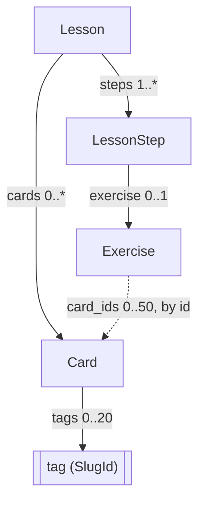
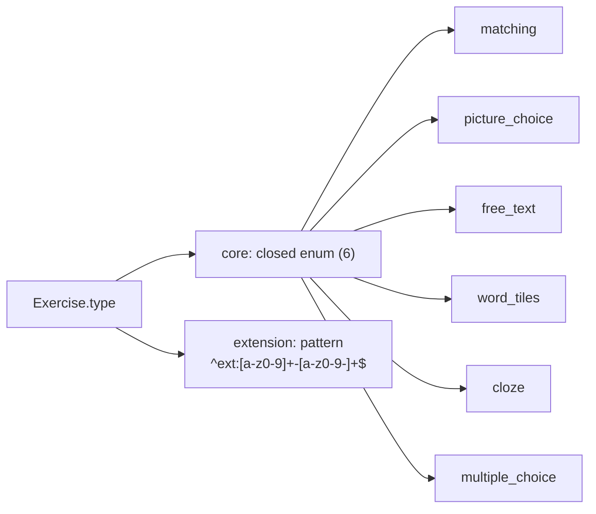
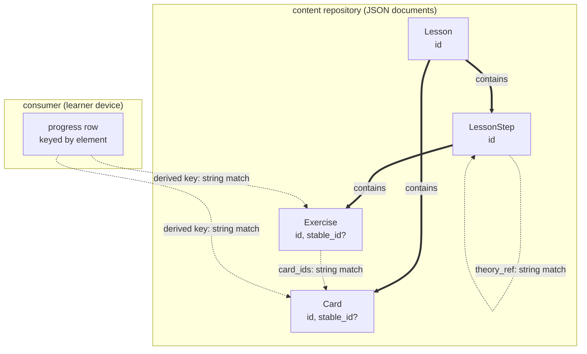

# Schema diagrams

Four pictures of the lesson format. They exist because the schema is hard to
hold in your head while reading it: sets, lessons, steps, exercises, cards,
six core exercise types plus namespaced extensions, and on top of that stable
identity, attribution and review status.

**Every diagram here is one of two kinds, and each says which it is:**

- **Generated** from `schema/lesson.schema.json`. It cannot drift, because
  `scripts/generate-schema-diagrams.mjs --check` fails the build when the
  committed picture no longer matches what the schema would produce.
- **Deliberately coarse.** It draws only relationships that change rarely,
  with no field lists and no complete enumerations, and it says in the text
  what it deliberately leaves out.

Hand-drawn AND detailed is excluded on purpose. The cost of fixing a stale
diagram is not the problem, Mermaid is text. The problem is that nobody
notices the fix is due, which is exactly how stale version claims and a
false ordering sentence survived in this repo for weeks.

- [1. Content structure](#1-content-structure-generated) (generated)
- [2. Exercise types](#2-exercise-types-generated) (generated)
- [3. The database view as a thinking model](#3-the-database-view-as-a-thinking-model-coarse) (coarse)
- [4. From repository to learner](#4-from-repository-to-learner-coarse) (coarse)

<!-- GENERATED:schema-diagrams BEGIN - do not edit by hand, run scripts/generate-schema-diagrams.mjs -->

<!-- schema x-schema-version: 1.11 -->

### 1. Content structure (generated)

Solid arrows are containment: the child object is nested in the parent
document. The dashed arrow is a reference BY STRING - `card_ids` holds
`Card.id` values, and the schema alone cannot check that they resolve;
the semantic layer does (`E-CARD-REF`). Cardinalities are the schema's
own `required` plus `minItems`/`maxItems`.

### 2. Exercise types (generated)

The schema knows 6 core types as a closed enum, plus any
`ext:` type matching the pattern. Extension types are NOT enumerated in
the schema: a lesson declares them in `requires_extensions`, and a
consumer that has not registered one refuses the lesson (`E-EXT-UNSUPPORTED`).

<!-- GENERATED:schema-diagrams END -->

## 3. The database view as a thinking model (coarse)

**There is no such database, and there should not be one.** The engine is
framework-agnostic and stores nothing; a lesson is a JSON document. This
diagram borrows relational notation only to make one distinction visible that
the schema cannot express: where a relationship is REAL (the child lives
inside the parent document) and where it is only a STRING that happens to
match somewhere else.

Coarse on purpose: no field lists, no complete columns. The four boxes and
the two kinds of edge are the whole point, and they have not changed since
schema 1.0.

Double arrows are containment, so they cannot break: the child is physically
inside the parent. Dashed arrows are string matches with nothing enforcing
them at the storage layer.

**This is why a text correction could orphan learner progress.** A progress
row is not a foreign key into a database. It carries a key the consumer
DERIVED from the content, and for a long time that key was derived from the
content itself. Correct a typo in an answer, and the derived key changes, and
the row now points at an element that no longer exists under that name. The
learner sees their history for that item vanish, and nothing anywhere reports
an error, because no constraint was violated: there was no constraint.

`stable_id` (schema 1.9) is the answer to exactly this. It is an
author-owned, mint-once value that is NOT derived from the content, so
correcting the text leaves it untouched. It closes the exercise and card
level. It does NOT close the level below - an answer correction inside a
surviving exercise still moves a content-derived element key, which is the
open remainder tracked as engine#91.

## 4. From repository to learner (coarse)

Where a field can get lost between an author writing it and a learner seeing
it. This view was missing more than once when a field was set correctly and
still had no effect.

Coarse on purpose: stations and direction only. The stations are stable; what
each one copies is not, and pinning that here would be a second place for the
same truth.

Two places where fields have actually disappeared, both found by measuring at
the END of the chain rather than at the start:

- **Author to index.** A field can be set in the manifest and never projected
  into `search-index.json`. It then looks correct in the repository and does
  not exist for any consumer, because the app reads the index, not the
  manifest. `review_status` was set on 47 sets and stayed invisible until the
  index generator was taught to project it.
- **Index to app.** A field the index carries can still be dropped by the
  consumer's own normalisation. The lesson from both cases is the same: the
  measurement has to happen where the consumer reads, not where the author
  wrote.

The registry adds a third, quieter failure: it pins a COMMIT per repository.
A repo can be perfectly correct on `main` while the registry still points at
an older commit, so the fix exists and no learner receives it. That is why
re-pinning belongs in the same session as any wave that moves those mains.

## Ordering is not drawn here

A set's display order is the lexicographic sort of the lesson ids, and no
arrow in any of these diagrams carries it - the manifest's `metadata.lessons`
list steers download discovery, not display. That is deliberate: see
[Lesson ordering](lesson-format.md#lesson-ordering), where the rule belongs
and where the gate (`W-SET-ORDER-*`) is documented.
